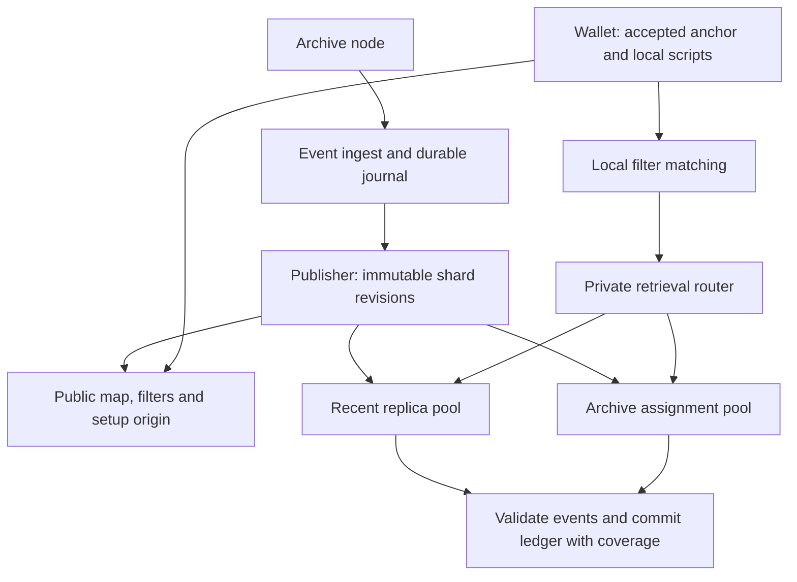

# Transparent PIR architecture

Source baseline: `8514863`, inspected 2026-09-07. See [status](status.md) for implementation limits and [deployment](deployment.md) for target parameters.

## Data and recovery

The service indexes confirmed receive and spend events under exact raw locking scripts. Spend extraction resolves each consumed previous output to its script. The wallet reconstructs a ledger, applies its own confirmation and spendability policy, and accepts its chain anchor independently of shielded scanning. The [contract](contract.md) defines completeness and privacy assumptions.

A shard is a consecutive height range (called a generation in historical research). Each shard has a public activity filter, a private two-choice script directory and private packed event pages. Short histories may fit inline. A table can have multiple equal-geometry segments for an indivisible oversized block. Both directory candidate rows and every required page are retrieved privately across all table segments; routing must not expose the chosen row or segment.

The router, assignment pools, external artifact origin and atomic fleet activation in this diagram are target components, not all implemented. The current service loads a whole published set.

## Component ownership

| Component | Source | Responsibility |
|---|---|---|
| Events | `pir/transparent-events` | Canonical chain event representation |
| Ingest, census, publish | `server/transparent-filter-server` | Resolve events, persist journal, seal and build shards, serve filters |
| Shard protocol | `pir/transparent-shard` | Geometry registry, deterministic packing, manifests and sealing |
| Retrieval service | `server/transparent-shard-server` | Verify publication, bound runtime cache, revision-addressed setup/query |
| Wallet | `pir/transparent-wallet` | Local matching, private retrieval, validation, ledger replay |
| Deployment | `ops/` and `.github/workflows/` | Build, distribute, preflight and activate artifacts |

## Identity and geometry

The source schema is `transparent-shard-v7`. A shard declares a named geometry from the compiled registry. A manifest commits layout and table digests; the public map names manifest revisions. Sealed contents remain immutable and manifests chain through parent digests. A tier boundary must be a shard boundary. Profile names must never be reused with different row shapes.

Revision identity must be preserved through setup, query, response, runtime cache and wallet coverage. The server verifies manifests when opening a set. The wallet still needs the explicit manifest retrieval/digest/geometry validation work in the plan. Hash consistency does not prove completeness or authenticate a malicious publisher's index merely because its terminal block hash is accepted.

The publisher supports recent/archive geometry and a forced `--recent-from` height. Census supports bounded inclusive ranges. A combined mixed-tier cost report must use the same boundaries and aggregate exact scripts across tiers; separate tier percentile summaries cannot be added.

## Serving and publication

The current cache retains prepared runtimes by byte reservation, builds on demand, and keeps active handles pinned. Plaintext sources are verified files rather than permanent copies in memory. Source defaults allow one construction, two evaluations and three superseded revisions per shard beyond the current one. An expired revision returns 409; cache pressure can return retryable 503. The wallet distinguishes these responses and bounds revision refreshes within one sync.

The target recent pool fully replicates its assigned hot set so the newest shard can use every worker's bandwidth. Archive ownership is disjoint and balanced by prepared bytes. Public routing uses set identity, shard, revision and table; selected script, row and page locator never determine a plaintext route. Public immutable filters/setup belong on an artifact origin; map discovery has refreshable cache semantics.

Prepare and verify artifacts at owners before publishing routing/map state. The existing `/v1/ready` only means a nonempty set loaded; fleet readiness must additionally attest assignment and revision identity plus the required warm runtimes. Restart/readiness semantics must distinguish an intentionally cold correctness pilot from the warm fleet.

## Wallet state and aging

A returning wallet must retain old outputs while applying new spends. Moving the birthday forward is not ledger continuation. Ledger changes, discovery scope, chain checkpoint and provisional coverage need one durable commit. Replacing a provisional revision replaces its covered range; reorg recovery rolls back to the accepted ancestor.

Freeze the initial geometry cutoff. Aging may change worker ownership after verified copying, but it does not change shard geometry, ids or history. Re-cutting into wider archive geometry is a future epoch transition requiring explicit identity and coverage recovery; do not implement a rolling cutoff that silently rebuilds old shards.
