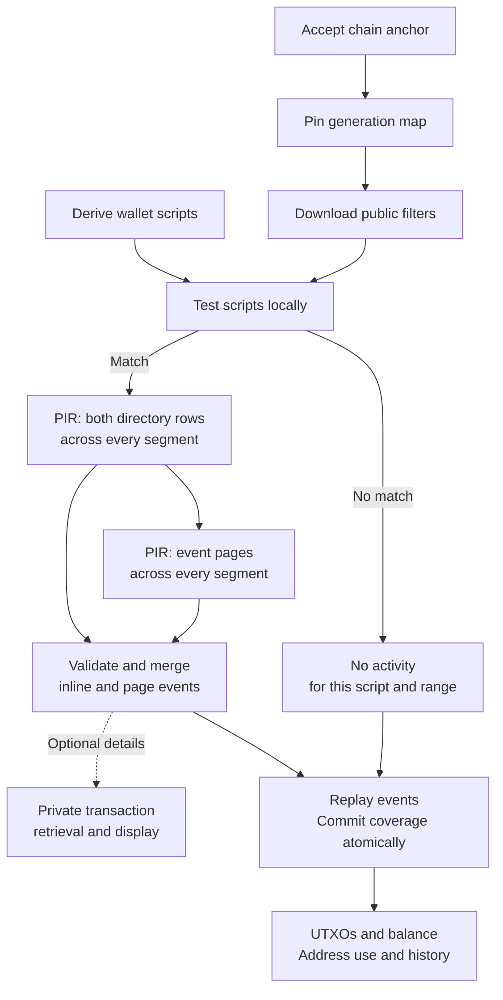
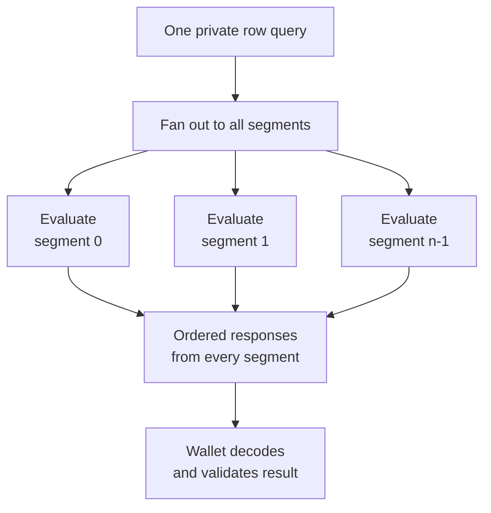
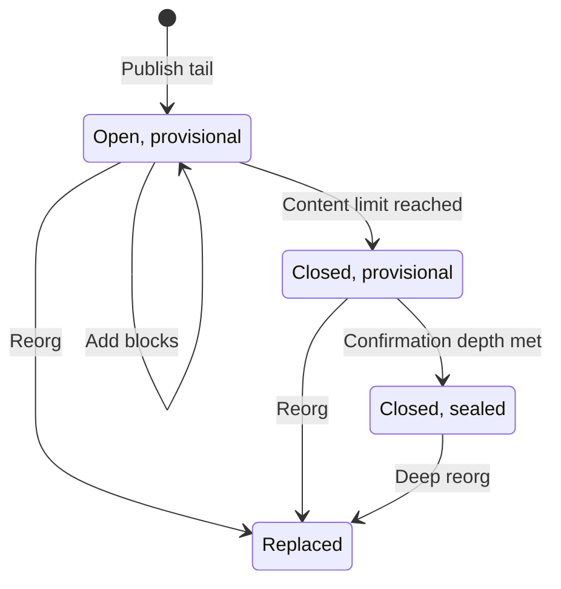

# Transparent PIR architecture

Date: 2026-09-06. Status: in-prototype

The proposed service lets a wallet privately recover every confirmed receive
and spend for its supported transparent scripts, then reconstruct its UTXOs,
balance, address-use state, and history. It publishes chain events keyed by
exact raw locking script. The wallet validates and replays those events against
an accepted chain anchor and applies its own spendability policy.

History is divided into **generations**: consecutive height ranges whose
boundaries depend on script and page occupancy. Each generation has a public
activity filter and fixed-size private tables. A wallet tests scripts locally
against the filter, then uses private information retrieval (PIR) to fetch exact
histories for matches. Each generation contains one or more **segments** of the
same table geometry, allowing unusually large blocks to be represented without
changing the geometry clients must support.

The implementation calls a generation a *shard*. This document uses
*generation* for the height range and *segment* only for a part of its storage.
Closing a generation stops block additions; sealing it additionally requires
its configured confirmation depth. These are separate transitions.



The no-match path assumes a complete index. Directory and page retrieval always
cover every segment; transaction-detail retrieval is optional.

The initial profile trusts the publisher and retrieval service for correct,
complete data. PIR hides row selection, subject to visible generation choices,
query counts, timing, and session linkage. It does not prove completeness or
hide the entire access pattern.

The census figures below support the proposed partitioning and public-filter
cost. They do not establish an end-to-end advantage over compact scanning.
The final section separates those figures from the measurements and protocol
work still needed.

## Recovery scope and responsibilities

The database publishes chain facts rather than calculated wallet balances.
The wallet owns address derivation, anchor acceptance, confirmation policy,
coinbase maturity, key availability, and coin selection. Anchor acquisition is
an independent interface: transparent recovery must not require shielded
scanning or regular compact-block synchronization.

The minimum confirmed ledger consists of:

1. Every transparent output controlled by a supported wallet script.
2. Every later input that consumes one of those outputs.

This must include outputs received and spent while the wallet was offline and
zero-balance histories. An empty current UTXO set is not evidence that a script
has never been used.

For full restoration, the database must cover the wallet's required history.
The current deployment's Ironwood start cannot reconstruct earlier transparent
history. A snapshot at Ironwood could establish a starting balance, but it
cannot reconstruct complete earlier history.

Mempool state, pending transactions, transaction broadcast, and wallet-local
metadata are separate capabilities. Labels, contacts, payment intent, fiat
values, and unbroadcast transactions cannot be recovered from the chain.

## Canonical event model

For every transparent output, index a receive event under the output's exact raw
locking script:

```text
ReceiveEvent {
    height
    block_hash
    txid
    transaction_index
    output_index
    value
    script
    coinbase
}
```

For every non-coinbase input, resolve the previous output and index a spend event
under that previous output's exact raw locking script:

```text
SpendEvent {
    height
    block_hash
    spending_txid
    transaction_index
    input_index
    spent_txid
    spent_output_index
    script
}
```

Previous-output resolution is mandatory. An input identifies an outpoint but
does not directly identify the script whose wallet must discover the spend.
Failure to resolve any previous output makes that indexed range incomplete and
must fail construction rather than publish a partial result.

Use stable event identities so retries and duplicate delivery are idempotent:

```text
receive identity = (txid, output_index)
spend identity   = (spending_txid, input_index, spent_txid, spent_output_index)
```

Events have one canonical order. It is protocol data rather than an
implementation detail, because pages are stored in it and wallets replay in it:

```text
order key =
    (height, transaction_index, receive before spend,
     output_index or input_index)
```

Transaction order places an output's creation before a later transaction in
the same block can spend it. Within a transaction, the receive-before-spend
rule gives builders a deterministic ordering between event types, so the same
events produce the same page bytes.

Duplicate delivery is idempotent on these identities. A repeat that differs in
any field is not a newer version of an event; it is a contradiction, and must be
rejected rather than settled by taking the later copy.

The first private profile may cover P2PKH and P2SH scripts, but unsupported
script classes must be reported as outside coverage rather than absent. Logical
identity is always exact script bytes, not an address string.

## Generation boundaries and storage

Partition the chain into generations with immutable published revisions.
Choose boundaries by content occupancy rather than a fixed block width:

```text
Generation 42
    heights: decided by content, published in the generation map
    parent block hash
    terminal block hash
    public activity filter
    segments: one or more, normally one
        private script directory
        private event pages
    optional private transaction details
```

Each generation manifest binds:

- network and genesis hash;
- schema and profile versions;
- seal parameters;
- start and end heights;
- parent and terminal block hashes;
- range closure and confirmation status;
- revision number and the revision it supersedes, if any;
- public-filter digest;
- PIR table dimensions, salts and row sizes;
- the complete segment list, with each segment's directory, page and
  transaction-table digests.

A generation's identity is the digest of its canonical manifest, and its
published directory is named by that digest. A manifest edited after
publication is refused rather than served under the identity of what it
replaced. Because the digest binds the segment list, a generation cannot gain,
lose or reorder a segment without becoming a different generation.

### Why boundaries depend on content

A fixed number of blocks does not imply a fixed script or page occupancy.
Consensus limits bound individual blocks, but sizing every generation for that
worst case would waste storage and PIR work during ordinary activity.

The census reported for Ironwood activation through height 3,473,474 covers
45,332 blocks and 869,283 events. Across 4,096-block buckets, density ranges
from 12.0 to 38.5 events per block. With a target of about 4,100 distinct scripts,
generation spans range from 124 to 1,746 blocks, a 14.1-fold difference. These
are different measures of variation: event density alone does not determine
distinct-script occupancy or page demand.

Content-based boundaries let ordinary generations use a standard segment
geometry despite that variation. Different block spans and exceptional segment
counts still affect query frequency, setup cost, and access-pattern leakage.

PIR parameter selection depends on `(rows, item_size_bits)` for a given scheme
and implementation version. Generations with equal geometry can therefore use
the same scheme parameters. Database-dependent setup remains specific to the
table contents and revision.

| Material | Cache or reuse identity |
|---|---|
| Shared scheme parameters | Scheme/version and table geometry |
| Public database-dependent setup | Manifest digest, table, segment, and setup profile; alternatively, a verified content digest for byte-identical setup |
| Secret query randomness | Fresh for independent queries |
| Evaluation keys | No bounded reuse across independent queries in the initial profile |

Changed tail databases normally need new setup. A fan-out query selects the
same within-segment row across multiple databases; compatibility with the PIR
scheme must be validated as one multi-database operation. Benchmarks must
charge setup and responses for every segment and include revision churn.

### What closes a generation

The tables are keyed differently, so no single quantity bounds them:

| Table | Sized by | Closes the range? |
|---|---|---|
| activity filter | distinct scripts | yes |
| script directory | distinct scripts | yes |
| event pages | page rows | yes |
| transaction detail | distinct transaction ids | only if built |

Total event count alone does not determine page demand. Pages are allocated
and padded per script, so many short histories that exceed inline capacity can
use more rows than the same events concentrated in a few long histories. Range
closure must therefore track page rows directly.

Each occupancy measure is monotone as blocks stream in, so one incremental
pass can decide the boundaries. Process every block, including blocks with no
supported activity, to preserve gapless height coverage. Close at a block
boundary according to the capacity and target rules below.

Distinct transaction IDs matter only if the optional transaction-detail table
is published. The first implementation counts and reports them but does not use
them to close ranges. In the reported census, that limit never bound under any
candidate policy: scripts or page rows determined every content-based closure.
Omitting the transaction table therefore leaves those measured boundaries
unchanged.

### Capacity and target

Blocks are indivisible. A generation just below a preferred occupancy can cross
it when the next block arrives. Each occupancy limit therefore has two values:

- **Capacity:** the hard aggregate limit for one segment's tables.
- **Target:** the preferred closing threshold, at or below capacity.

If adding a block would exceed capacity, close the current nonempty generation
before adding it. Otherwise add the block, then close if any target has been
reached. If the block alone exceeds capacity, give it a generation of its own
and enough segments to hold it. Directory collisions can also require extra
segments even when aggregate occupancy is below capacity.

At a 4,096-script target, the reported census reached at most 4,506 scripts:
410 scripts, or about 10.0%, above target. Capacity set 15% above target would
cover this observed script overshoot. It is neither a worst-case block bound nor
a guarantee that directory placement fits one segment.

Above roughly 8,000 scripts in the candidate policies, page rows determined
every content-based closure. Increasing an already nonbinding script threshold
would not make those generations larger.

### Segments and oversized blocks

A valid block may exceed one segment's capacity. The service must represent it
automatically; rejecting it would allow a valid block to halt indexed coverage.
Each generation therefore has one or more segments with the standard directory
and page geometry. Ordinary generations normally need one.

Directory placement uses two candidate **within-segment** rows per script,
derived with independent salts modulo the fixed directory row count. These
candidates do not change when another segment is added. Process scripts in
lexicographic raw-byte order. For each script, choose the lowest-numbered
segment with space in either candidate row, then the less occupied candidate
(ties choose the first candidate). If neither candidate has space in any
existing segment, append an empty segment and insert there. Sort each completed
row by exact script bytes before encoding it.

This is a terminating placement rule even if every script has the same two
candidates. If a directory row has `K >= 1` slots and there are `N` supported
distinct scripts, opening another segment means at least `K` records already
occupy every earlier segment. Thus at most `max(1, ceil(N / K))` directory
segments are needed. No reseeding success or retry limit is part of the rule.
Pages are packed into contiguous extents in the same script order. If they need
`P` rows and a page segment holds `R` rows, they need `max(1, ceil(P / R))`
segments. Publish the maximum of these two counts, padding the other table's
extra segments with empty rows. The manifest commits to that complete count
and ordered segment list.

An oversized block is closed as a generation of its own. Ordinary generations
close before adding a block that breaches their configured single-segment
capacity, or after reaching a target. Supported scripts have bounded record
sizes; unsupported classes remain explicitly outside coverage. Every finite
valid block therefore has a finite representation without changing geometry.
The revised layout uses versioned, checked unsigned 64-bit count and extent
fields, with row packing recalculated within the pinned row widths; the profile
must verify that the active consensus block limits and configured ordinary
range capacities fit those fields. Exhausted memory or disk is resumable
operational backpressure, not a reason to reject the block or advance coverage.
Builders may stream segments to disk; serving need not load them all at once.

A wallet advances coverage for the generation's range only after processing
every segment. A partial segment set is incomplete work, not a shorter answer.

Segments must not become publicly selected shards. A wallet issues one request
per private row lookup and table; the service evaluates that request against
every segment of the generation and returns the per-segment results, which the wallet
decodes and matches on exact script bytes. What becomes public is the segment
*count*, which the manifest publishes anyway. Which segment holds a script is
not disclosed by the request. Letting a wallet ask for the segment its script
hashes into would reveal part of the script's identity before PIR begins, which
is the script-prefix sharding rejected under *Private script directory* below.

For each row lookup, a generation with `n` segments requires `n` server
evaluations and responses. Fan-out can share the request upload; responses,
database-dependent setup, and server work scale with segment count. The design
accepts this exceptional cost to keep client table geometry fixed.



Both directory candidates use this pattern. Page lookups do too: the wallet
converts a global page address to a segment ordinal and a within-segment row,
but sends only the private row query. The server evaluates every segment; the
wallet uses the appropriate returned page. The request does not disclose the
target segment.

### The published generation map

Content-derived boundaries depend on the indexer's event set. If operators
independently derive boundaries from different events, the first disagreement
can shift later ranges and make their digests incomparable.

The height-to-generation map is therefore committed protocol data. Operators
reproduce its published boundaries when comparing generation contents, so an
event disagreement remains localized to the affected range. A wallet also uses
this map to find the generation containing its birthday height; there is no
fixed width from which to calculate it.

Seal parameters are part of the schema. Changing them changes the partition,
so clients cannot combine coverage from different partitions without explicit
reconciliation. Existing sealed generations remain immutable; new parameters
apply to new ranges. The resulting block spans and segment counts disclose
aggregate activity already visible on the public chain.

### Tail publication and revisions

Recent blocks are published as a growing **tail**, allowing coverage to reach
the publication anchor before the next content boundary is reached. Publishing
the tail also limits the range of work normally replaced as recent blocks
arrive or reorganize.

A range has two state dimensions: **open or closed** to additional blocks, and
**provisional or sealed** under the confirmation policy. Only closed ranges may
be sealed. Several closed provisional ranges can precede the one open tail.
Unpublished builder state is not addressable.



Each transition publishes a new immutable revision. A reorg replaces affected
ranges through a new map; it never edits their existing objects.

Every published range version is an immutable revision identified by its
canonical manifest digest. An open range gets a new revision when it grows;
closing it or changing its confirmation status also creates a new manifest.
Each revision names its predecessor revision, if any. Sealing means eligible
for long-term reuse on the selected chain, not immunity to a deep reorg.

An immutable **map revision** commits to the network, accepted publication
anchor, confirmation policy, preceding map digest and the complete ordered list
of range manifest digests, including closed provisional ranges and the tail.
Adjacent ranges must have consecutive heights and matching terminal/parent
block hashes. Ordering is committed by the map, not a chain restricted to sealed
manifests. Publish all referenced objects durably before atomically advancing
the current-map pointer. A client pins one map revision for each sync attempt.
Under the initial trusted-service policy this establishes consistency with the
publisher's declared anchor, not an independent proof of chain membership.

The revised layout and map protocol use new schema/profile versions; clients
must reject unknown versions rather than interpret them as the current layout.
All setup, queries, responses, caches and pending work bind the full range
manifest digest, table and profile; ordered fan-out responses also bind each
segment ordinal. A numeric generation id alone is not a revision identifier.
Published objects never change under their digest. An acquired map has a public
retention lease lasting at least one hour, renewable while its objects remain
available; all its manifests, filters, setup and rows remain retrievable until
the lease expires. Garbage collection cannot remove objects under an active
lease. An expired revision returns an explicit revision-expired result, never
silently serves a newer one. The client then acquires a new map and restarts
affected pending work without advancing coverage. Lease requests refer only to
public map revisions, not scripts or selected rows.

Coverage records the map, manifest and chain anchor that produced it. On a
superseding revision, roll back that range and affected later state to the last
retained valid checkpoint and replay the replacement; do not merge two revisions
as if their events were disjoint. Sealed coverage may be reused while selected
by the accepted chain. A deep reorg publishes a replacement map sequence and
invalidates affected coverage even if it was previously sealed. Old objects
remain immutable and are retained according to their leases.

A wallet whose accepted anchor lies inside a published range may retrieve that
range's filter and complete script histories, validate their structure, then
replay only events at or below its anchor height. Before taking coverage, the
anchor provider must confirm that the range's declared chain contains the
wallet's accepted hash at that height. Under the initial trust policy the
publisher may supply that ancestry assertion; a wallet requiring independent
confirmation uses its anchor provider. If ancestry cannot be established,
coverage remains pending. Downloading later events never advances the wallet's
anchor or confirmation policy. A provider behind the requested anchor reports
its actual coverage height; the wallet may show that explicitly stale result
but cannot label it current through the requested anchor.

## Chain anchors without regular-sync coupling

Every reconstructed balance is relative to a precise chain state: a network,
height and block hash. The transparent protocol therefore needs an accepted
anchor, but it must not prescribe regular wallet synchronization as the way to
obtain one.

The client consumes a wallet-owned abstraction:

```text
ChainAnchor {
    network
    genesis_hash
    height
    block_hash
    observed_tip_height
}
```

Possible providers include the wallet's existing sync engine, a minimal
header/checkpoint client, comparison across independent block-hash sources, or a
trusted signed checkpoint service. A research POC may accept the indexer's
declared anchor under the existing trusted-indexer assumption, but it must
record that choice and compare the anchor with an independent source during
evaluation.

Historical generations form a committed, gapless sequence. Each manifest binds
its range, parent and terminal block hashes and content digests; the map
revision commits to their complete order. A wallet can validate that sequence
against one accepted terminal anchor without retaining or downloading ordinary
compact data for every covered block.

Under the trusted-service policy, structural validation establishes consistent
network, ranges and generation selection. Freshness additionally requires an
accepted anchor and a publication map covering it. Structural validation does
not prove that the indexer included every event. Completeness remains the separate trust decision described below.

The provisional suffix, including closed ranges and the growing tail, normally
requires active reorg tracking.
Historical generations may be sealed after an explicit confirmation depth. A
deep reorg crossing a sealed boundary requires a replacement committed sequence
and rollback to an anchor accepted through the same provider interface.

## Public activity filter

Each generation has a public probabilistic filter containing every exact script
with at least one receive or spend in that generation. A wallet downloads the
same filter bytes as every other wallet and tests its derived scripts locally.

- A negative result lets the wallet skip private retrieval for that script and
  generation, under the complete-indexer assumption.
- A positive result is only a candidate. The wallet privately retrieves exact
  records and rejects false positives.

The filter may use BIP-158 GCS encoding, but a generation filter is a new
application profile rather than a canonical per-block Bitcoin basic filter. It
needs deterministic generation-key derivation and explicit chain-range
metadata.

Larger generations deduplicate scripts across more blocks and reduce filter
overhead. A match identifies only a generation, however. That works here because
private retrieval returns the script's exact events; scanning every block in a
matched generation would lose much of the benefit.

For a filter with `N` elements, GCS maps elements into `[0, N*M)`. Under the
hashing assumptions, the false-positive probability for a nonmember is
approximately `1/M`; increasing the generation width does not itself require a
different false-positive parameter. Filter size grows with the number of
distinct scripts. Deduplication across blocks reduces that number.

The reported census puts the complete filter payload for this range at
0.40–0.51 MB across candidate policies, compared with roughly 108 MB for
coverage-matched compact scanning. The 19-generation policy uses about 0.40 MB;
the 50-generation policy uses about 0.51 MB. These figures exclude the map,
manifests, PIR setup, and private retrieval. They establish a small filter
payload, not a small total restoration cost.

Filter bytes must be globally identical, immutable, cacheable, and committed by
public digests. A service must not personalize filters. Otherwise a malicious
service could insert chosen scripts into wallet-specific filters and observe
whether a private query follows.

## Private script directory

The logical directory maps a script to its event storage:

```text
script -> {
    exact_script
    total_event_count
    inline_events
    first_event_page
    event_page_count
}
```

Physically place records into fixed-size PIR rows:

```text
candidate_row[j] =
    H(bucket_salt[j] || length(raw_script) || raw_script) mod directory_row_count

query both candidate rows in every segment
```

A script's pages are a contiguous extent, not a list of locators: the record
carries the first page and the page count, and the pages follow in order. A list
would make the record's size depend on the history's length, which a fixed-width
row cannot express, and would force either a truncated record or a second
geometry. A generation's page space is its segments' page tables concatenated in
segment order, so an extent crossing a segment boundary is ordinary addressing
rather than a special case.

Every record must carry the exact script bytes. The client must reject hash
collisions, misplaced records, duplicate records, and filter false positives.
Rows contain a fixed number of uniformly padded slots; empty and occupied slots
must have identical response geometry.

Bucket overflow uses the deterministic additional-segment placement rule above.
It must never trigger a public script, address, outpoint, or transaction lookup.

If the physical database is further sharded, temporal sharding is preferable to
script-prefix sharding. Selecting a script-hash shard reveals part of the
script's identity before PIR begins. Selecting a temporal generation reveals a
chain range but preserves the full script anonymity set within that generation.

Row count is pinned per segment. A generation's total row count varies with
its public segment count; both segment count and block span reveal aggregate
chain activity, already present in the public chain.

## Private event pages

Histories that do not fit inline in the directory record are stored in
fixed-size pages:

```text
EventPage {
    generation_id
    exact_script
    page_ordinal
    page_count
    event_count
    minimum_height
    maximum_height
    events[]
    padding
}
```

The private directory response supplies a page extent. Follow-up page selection
must itself use PIR; a page index must never appear in a plaintext request.
Otherwise the directory is private while its page access pattern identifies the
selected history.

Pages are ordered by the canonical order key. Height bounds allow
a previously synchronized wallet to navigate to the first page newer than its
checkpoint. Navigation must either be private or use a public layout that is
identical for all scripts; a free plaintext index would disclose history shape.

Large or spammed histories require more pages. Query budgets must leave work
resumable and incomplete rather than truncating history or silently advancing
coverage.

## Optional private transaction-detail table

The first implementation omits this table. Script events support current
balance and basic net history; transaction details add another table geometry,
setup cost, and potential closure limit. Build the table only if the wallet's
transaction-display requirements cannot be met from events and locally retained
data. The census counts transaction IDs to inform that decision, but adding the
table later must still be checked against its actual storage requirements.

A restored wallet may know that one of its outputs was spent without knowing all external
recipients, change outputs, or enough input values to calculate the exact fee.

If those features are required, publish an additional private table:

```text
txid -> CompactTransparentTransaction {
    txid
    transparent_input_outpoints[]
    transparent_outputs[] { value, script }
    other wallet-required transaction metadata
}
```

After discovering a relevant transaction ID through the script ledger, the
wallet retrieves its compact transaction privately from the same temporal
generation. Transaction IDs and transaction-table locators must not appear in
plaintext requests.

## Transparent ledger and wallet-wide history

Transparent funds form a subledger that can be reconstructed independently of
shielded scanning. For each transaction:

```text
transparent credits = owned transparent outputs created
transparent debits  = owned transparent outputs consumed
transparent delta   = credits - debits
```

Shielding appears as a transparent debit; a shielded-to-transparent transfer
appears as a transparent credit. Paying another user also produces a debit.
Transfers between owned transparent addresses contain both credits and debits;
the net need not be zero, for example when transparent funds pay the fee.

The transparent ledger need not classify an outflow as shielding, payment, or
another mixed-pool operation to calculate its balance. Wallet-wide presentation
can add those classifications later using the additional information it needs.

## Wallet reconstruction

Before replay, merge inline events and every required page across segments
into canonical order. Maintain an applied-event identity journal alongside the
ledger: an identical already-applied event is a no-op even if its output has
since been spent, and any field mismatch is a conflict. Duplicate checking and
event application commit atomically. Reorg rollback removes the reverted
journal entries before applying replacement-chain events.

The following handlers run only for previously unapplied event identities:

```text
on ReceiveEvent:
    reject an outpoint already created by a different applied event
    utxos[(txid, output_index)] = {
        value,
        script,
        creation_height,
        creation_block_hash,
        coinbase
    }

on SpendEvent:
    require the consumed outpoint to exist
    remove utxos[(spent_txid, spent_output_index)]
    record the confirmed spender
```

An unexplained spend of an unknown receive is unresolved work. It may indicate
missing historical coverage, an incomplete index, an unsupported script, or a
malformed response. It must not be ignored.

After complete replay through an accepted anchor:

```text
current UTXOs = recovered receives - recovered spends

confirmed balance = sum(values of current UTXOs)

spendable balance = sum(values of current UTXOs allowed by wallet policy)
```

Spendability remains wallet-owned policy. The wallet applies confirmation depth,
coinbase maturity, script support, key availability, locks, dust policy, and
coin selection. Recovery of a receive does not by itself make an output
spendable.

For history presentation, group events by transaction ID:

```text
net value =
    sum(wallet-owned outputs created by the transaction)
    - sum(wallet-owned outputs consumed by the transaction)
```

Transactions with both receives and spends may be self-transfers or change.
Exact recipient, change and fee presentation can use the optional private
transaction-detail table plus the wallet's derivation metadata.

## Address discovery

PIR does not remove the wallet's HD discovery problem. The wallet must:

1. Derive its normal external and change script window.
2. Test those scripts against the relevant generation filters.
3. Privately retrieve exact events for candidates.
4. Advance its existing gap-limit rules only on validated real activity.
5. Repeat until the wallet's normal discovery policy is satisfied.

Do not introduce a separate PIR gap rule. Newly derived or imported scripts must
be checked over their required earlier chain range before inheriting current
coverage. Imported keys absent from the wallet backup cannot be reconstructed.

## Synchronization and atomic progress

For each generation covered by an accepted anchor, the wallet:

1. Pins a map revision and retention lease; verifies network and genesis
   identity, ordered manifest membership, gapless ranges and anchor compatibility.
2. Validates and locally matches the public activity filter.
3. Privately retrieves directory rows for candidate scripts, across every
   segment of the generation.
4. Validates exact script identities and directory invariants.
5. Privately retrieves every required event page and transaction-detail row.
6. Validates event identities, canonical order, range, uniqueness and
   references.
7. Applies events to pending ledger state.
8. Atomically commits ledger state and per-script generation coverage, once
   every segment of the generation has been processed.

A crash, timeout, malformed response, stale generation, incomplete segment set,
query-budget exhaustion, or authentication failure leaves coverage unadvanced.
Completed private rows may be journaled for idempotent resumption. Coverage
taken from any provisional range revision is recorded with that revision's digest
and re-derived when a later revision or the sealed generation appears.

Coverage is tracked by script/discovery scope and chain range, separately from
shielded synchronization. A partial result may display known events as
incomplete, but it must not claim a synchronized balance.

On a reorg reported by the anchor provider, rewind events and coverage to an
accepted common ancestor, rebuild the UTXO map from retained events, and discard
affected pending work. Immutable historical generations are reusable only while
their terminal commitments remain in the sequence rooted at the accepted
anchor. This mechanism depends on the chain-anchor interface, not on shielded or
compact-block synchronization.

## Access-pattern privacy

The initial privacy model is a service that follows the protocol but observes
its requests. Row-selection privacy is conditional on the disclosed access
pattern; it is not a claim that a wallet's scripts cannot be inferred. A linked
combination of generation selections and page counts may uniquely match a
public script's history. Evaluation must report how many public scripts remain
consistent with observed workload patterns, including repeated sessions.

PIR hides the selected row within the selected database. It does not inherently
hide:

- which temporal generation was selected;
- when the wallet queried it;
- how many queries it issued;
- request and response sizes;
- whether a filter hit triggered contact;
- linkage between repeated sessions.

If the wallet queries a generation only after a filter hit, the PIR server can
infer probable activity in that generation. Repeated selections reveal a coarse
activity timeline that may correlate with public transparent transactions.

Content-based boundaries make the disclosed time interval narrower in periods
with high script or page occupancy. In the reported sample, the widest and
narrowest generations differ by about fourteenfold in block span. That measures
variation in the disclosed interval, not a fourteenfold change in identification
risk; the latter depends on the public histories consistent with the complete
observed pattern.

An exceptional generation's segment count is public as well, and a wallet
querying such a generation pays a proportionally larger amount of work. Uniform
fan-out hides the selected segment directly, but the resulting traffic
still participates in the access-pattern inference described above.

The initial design may explicitly accept generation, timing and query-count
leakage, but it must not describe that as hiding whether the wallet had activity.
Possible stronger modes include:

- fixed schedules with indistinguishable dummy queries;
- fixed query counts and response geometry;
- delayed batching of matches;
- querying a fixed group of generations with decoys;
- an unlinkable relay or privacy network;
- a global PIR namespace that hides generation selection at higher cost.

There is a fundamental trade-off: suppressing PIR work after a negative filter
reveals, to a linked observer, whether a later query occurred. Cover traffic can
hide that bit only by paying some of the work the filter was intended to avoid.

## Trust and completeness

The initial profile trusts both the publisher and the PIR retrieval service to
provide correct, complete, mutually consistent data for the declared chain
anchor. Wallet validation checks structural consistency; it does not
cryptographically prove event inclusion, completeness, or non-equivocation.
Users who do not accept that trust can run their own infrastructure or verify
the result through independent chain replay. Query privacy remains a separate
requirement, subject to the generation, timing and query-count leakage described
above.

PIR provides query privacy; it does not prove database completeness. A filter
negative is safe only if the indexer included every covered receive and resolved
spend. Block hashes and table digests bind returned data but do not prove the
absence of omitted events.

Production use for balance or spendability therefore requires either:

1. an explicit trusted-indexer policy accepted by the wallet owner; or
2. a separately specified completeness mechanism.

Under this initial trust policy, evaluate the reconstructed ledger in shadow mode
against an independent archive-derived result at the same anchor. Require exact
event and UTXO equality, not only equal final balances.

## Recommended first implementation

Build on the existing integrated prototype rather than replacing its model:

- immutable content-sealed generations, with a published height-to-generation
  map;
- one public activity filter per generation, under its own keying;
- a fixed-row private script directory, identical in geometry across
  generations;
- two candidate directory buckets, independently salted per generation, with
  fixed within-segment candidates and deterministic overflow into added segments;
- a small number of inline events holding a script's newest history, so catch-up
  needs no page query when all events after the checkpoint fit inline;
- fixed-size, privately selected event pages;
- exact event replay with atomic checkpoint advancement;
- immutable provisional tail revisions alongside the sealed historical
  generations.

Do not build the private compact-transaction table yet. Build it only if the
wallet adapter confirms that its existing transaction-display path cannot
reconstruct required details from script events and locally retained data.

Choose seal parameters from the real event journal, then evaluate the complete
wallet workload. The binding occupancy limit determines generation size; raising
a nonbinding limit provides no benefit. The reported census supports candidate
selection but does not yet establish the best end-to-end policy.

Evaluate candidate seal parameters using:

- filter bytes after cross-block script deduplication;
- directory and page PIR upload and response bytes;
- per-generation published setup, multiplied across the generations a restoring
  wallet touches;
- false-positive private queries;
- active, inactive, restoration and catch-up workloads;
- large and externally spammed histories;
- realized occupancy distributions, including overshoot past target;
- multi-segment generations, and the query and byte multiple they cost on both
  sides;
- tail-revision churn: bytes re-fetched when a revision is superseded, and again
  when its range seals;
- client memory and latency on the minimum supported device;
- server CPU, concurrency, and resident bytes per loaded generation, as a
  function of its segment count;
- reorg, interruption and tail-publication behavior;
- timing and generation-selection leakage.

The architecture succeeds only when the complete cost is lower than the same
coverage through transparent compact scanning:

```text
public map, manifests, and filters
+ PIR setup
+ directory queries
+ event-page queries
+ optional transaction-detail queries
+ retries and cover traffic
< coverage-matched compact scanning
```

### Evidence and remaining work

The figures below were recorded in the preceding version of this document for
the Ironwood-to-height-3,473,474 census. They are retained as reported
measurements, not new benchmark results. The raw output and exact candidate
configurations for this content-boundary census are not linked here; archive
them before using these figures as a reproducible performance claim. MB values
retain the original report's units and rounding.

| Reported measure | Result | What it establishes |
|---|---|---|
| Journal coverage | 45,332 blocks; 869,283 events | Scope of the sample, not full historical recovery |
| Event density in 4,096-block buckets | 12.0–38.5 events/block | Occupancy varies across time |
| Generation span near a 4,100-script target | 124–1,746 blocks | About 14.1-fold span variation, calculated from the reported endpoints |
| Maximum scripts at a 4,096 target | 4,506 | About 10.0% observed overshoot; 15% headroom covers this script count |
| Binding limit above roughly 8,000 scripts | Page rows for every content-based closure | Raising the script limit alone would not widen these generations |
| Complete generation-filter payload | 0.40 MB for 19 generations; 0.51 MB for 50 | Public-filter bytes only |
| Coverage-matched compact scanning | Approximately 108 MB | Comparison baseline for the same range |
| Multi-segment generations in the sample | None | No empirical exceptional-path cost established |
| Tail-revision churn | Not measured | No revision-refetch cost established |

For implementation context, see the [boundary selector](../pir/transparent-shard/src/seal.rs),
[table builder](../pir/transparent-shard/src/build.rs), and
[census command](../server/transparent-filter-server/src/bin/shard-census.rs).
The [mainnet study](transparent_pir_mainnet_study.md) and
[incremental evaluation](transparent_pir_incremental.md) provide related
prototype evidence; their results must not be treated as measurements of this
complete revised protocol.

The decisive measurements still missing are private retrieval for a real
restoration workload against these generations; setup summed over every touched
generation and revision; server resident memory per loaded generation; and
end-to-end latency and memory on the minimum supported device. Any of these
could eliminate the apparent advantage suggested by filter bytes alone.

The implementation already has multi-segment construction and tail manifests,
but its directory builder rehashes with a retry cap. It does not establish the
deterministic placement and publication guarantees specified here. Those need
implementation plus adversarial placement and state-transition tests, including
revision retention, interruption, reorgs, and atomic coverage advancement.
Exceptional-path and revision-churn costs also remain unmeasured.

The optional transaction-detail table and bounded evaluation-key reuse are
outside the first implementation. No claimed result may depend on their cost
or benefit without measuring and identifying that dependency.

Under its stated trust policy, this design can reconstruct confirmed balance
and history with PIR row privacy conditional on the disclosed access pattern.
It does not, without additional measures, hide the queried time range, the occurrence of activity-triggered contact, wallet network
identity, or omissions by the indexer.
