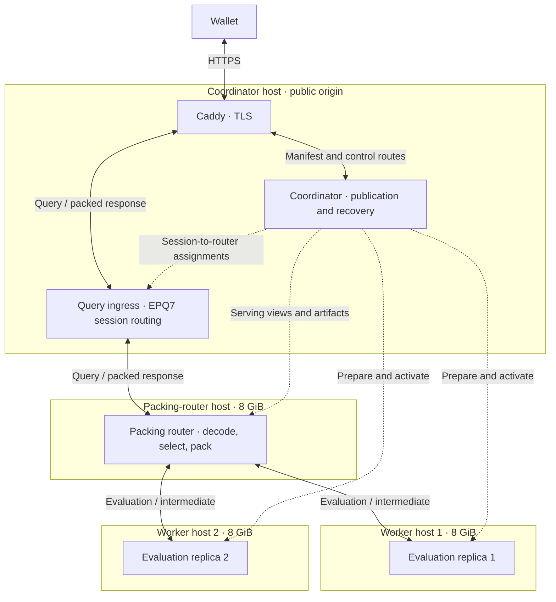
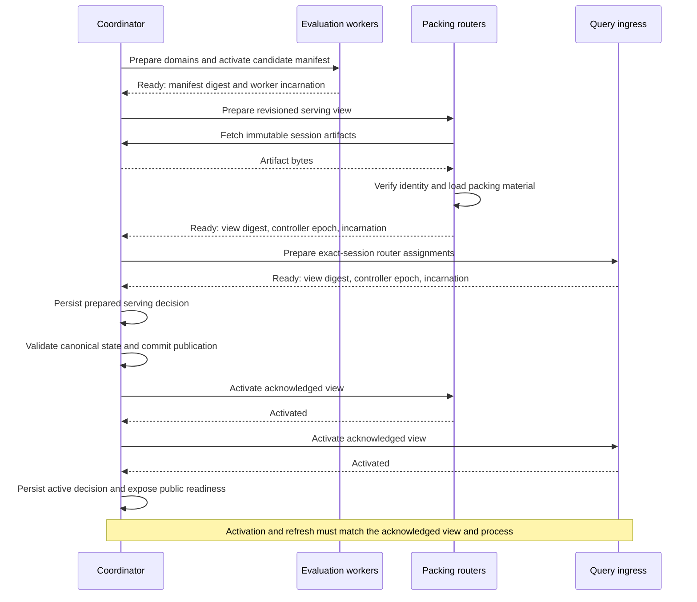

# Enhance PIR v7 architecture

Enhance PIR serves `ironwood-enhance-pir-v7`, schema 11, using fixed storage
shards, composed query domains and content-bound wallet sessions. The coordinator
owns ingestion, publication, placement and recovery control. A separate packing
router decodes wallet queries and packs results; worker replicas evaluate private
row queries. The September 24, 2026 rollout deployed EPQ7 query ingress, a dedicated
8 GiB packing router and a two-worker pool with replication factor two. The
coordinator retains public session metadata and immutable artifacts, with zero
resident serving packing objects in this mode. See the
[rollout evidence](../evidence/architecture2-2026-09-24/README.md) and
[qualification](qualification.md) for measured limits and outstanding gates.

## Data and query path

Each commitment-tree position identifies a 653-byte suffix record. There are
33 records per row and 32,768 rows per fixed storage shard: 1,081,344 records.
Storage shard `i` owns `[i * 1,081,344, (i + 1) * 1,081,344)` forever. There
are no loans, returns, lender counts, or settling assignments. Wallets support
at most 24 storage shards, including exactly 24 full shards.

Caddy terminates TLS at the existing public wallet endpoint. The deployed topology
below uses solid arrows for requests and responses, and dashed arrows for internal
publication and control. Each evaluation goes to one selected worker; the two
worker paths are alternatives, not query fan-out.



Ingress reads the fixed EPQ7 binding prefix at `/v1/enhance/query` and forwards the
bounded upload to a router assigned to that exact session, without decoding upload
keys or packing. The router validates and decodes the request, selects a ready
worker from its activated placement view, and sends a bound evaluation request.
It checks the intermediate's binding, shape and coefficient range, then packs it
using that request's upload keys and the pinned session's resident packing material.

No synchronous coordinator lookup is needed per query. The coordinator process
no longer receives public query bodies or packs their responses. The public URL,
EPQ7 framing, session identities and response bindings are unchanged by this
separation. Wallets neither select nor learn physical replicas. Session identity
binds packing material, not the process or host performing packing.

Caddy and ingress remain on the coordinator host, so query traffic still crosses
that host's NIC and its failure removes the public endpoint. A separate packing
host does not provide origin high availability. Evaluation and control APIs remain
private under the existing trust model, with network access restricted to the
serving and control tiers.

Workers run one evaluation per admitted query, without waiting to collect a
batch. On the tested 8 GiB x86 workers, singleton scans completed 458 of 480
queries at 16 offered QPS with 2.4-second p99 latency; experimental batches
completed 416 with 10.5-second p99. The
[Linux comparison](../evidence/batching-linux-2026-09-24/README.md) records the
hardware and workload. Batching needs a demonstrated gain on the intended
hardware before it becomes part of the serving path.

Storage ownership, query coordinates and serving placement are separate:

| Object | Meaning | Identity |
|---|---|---|
| Storage shard | Fixed global row range; immutable once sealed | Global row start divided by 32,768 |
| Query domain | Ordered units evaluated under one setup seed | Domain ID and content-derived session ID |
| Routing view | Canonical mapping from populated global rows to domain-local rows | Routing revision, recovery epoch and chain anchor |
| Session | Content, geometry, setup and packing material used by the wallet | Digest of the bound material and domain recovery epoch |
| Placement | Ready evaluation replicas serving the domain; router assignments are separate | Placement revision |

## Record metadata and fees

The coordinator derives each record's metadata from the canonical block. Every
Ironwood action of a transaction carries the same expiry, transparent input and
output flags, and fee. The fee is the whole transaction's: the remaining value of
its transaction value pool, that is transparent inputs minus transparent outputs
plus the Sprout, Sapling, Orchard and Ironwood value balances. It is not attributed
to an account or to individual actions.

A coinbase transaction has no fee of its own; its records have the fee-absent flag.
For any other transaction, every spent transparent output must be known. The
producer resolves spent outputs only for non-coinbase transactions with Ironwood
actions and transparent inputs: first from earlier transactions in the same block,
then from a bounded cache of recent outputs (`--prevout-cache-outputs`, default
250,000 outputs, whole transactions evicted oldest first), then with one JSON-RPC 2.0
batch of `getrawtransaction` calls per 256 missing transactions. Returned
transactions must have the requested txid. A missing transaction (-5), an output
index past the transaction's outputs, a duplicate input, a negative value pool, or
any RPC or batch-shape error fails the whole block; the coordinator retries it at
the next poll. The producer never publishes zero, a guess or a partial input total.
Blocks without such a transaction issue no extra RPC.

Cache entries are keyed by outpoint, and a txid commits to its outputs, so an entry
remains correct after a reorganization. Coordinators before this rule published a
fee only for pure-Ironwood transactions. A restart with the fixed binary does not
change records already in the journal; [deployment](deployment.md#repairing-historical-fees)
describes the offline rebuild and its adoption.

## Placement, serving state and admission

Each query domain is placed on `r` workers from a pool, with `r = 2` by default.
The frontier can use a higher factor when capacity permits; production starts
with two workers and factor two. Each selected worker holds the complete domain
assignment. Inventory groups remain legacy containers, but placement and readiness
no longer require rigid worker pairs. The reservation ledger and persisted
operation phases still govern preparation, activation and draining. Moves retain
source and destination reservations until draining completes; insufficient
capacity preserves the published placement rather than publishing partial
replication.

Pool placement allows individual-worker growth and additional frontier replicas
without giving every sealed domain the same replica count. Two copies still yield
roughly 50 percent raw storage efficiency. Router assignments and their replication
factor are independent of worker placement. Adding evaluation replicas does not
create more packing objects on an existing router.

A router shares one packing object across evaluation replicas using the same
material. Distinct retained frontier material requires distinct objects; verified
identical immutable material may be shared. Routing or placement changes alone do
not require copies. For resident material `P`, `r` evaluation replicas and `k`
router copies, worker-side packing would cost approximately `r × P`; separate
routers cost `k × P`, excluding preparation and request allocations. Router
replication therefore still duplicates the sessions those routers serve.

The initial router serves all assigned domains that fit its budget. The implemented
ingress can route exact sessions to separately assigned routers and rotate among
assigned copies. Partitioning assignments avoids loading the full working set on
every router. A single router remains a failure and throughput boundary for its
domains even when several evaluation workers are ready. Replacement routers need
capacity and exact-session readiness before receiving traffic. Physical
multi-router moves, overlap, draining and replication still require qualification;
automatic fleet expansion is not enabled by this rollout.

| Responsibility | Owner | Rule |
|---|---|---|
| Eligibility and assignment | Coordinator | Publish exact-session-ready workers and router assignments |
| Worker selection | Packing router | Choose the eligible worker with the fewest evaluations outstanding through this router; rotate equal-load ties |
| Public request admission | Ingress and packing router | Bound reception and forwarding at ingress; reserve the complete decode/evaluate/pack lifetime at the router |
| Evaluation admission and scheduling | Worker | Enforce local resource limits and run one evaluation per admitted query |

Router counts guide selection without a live worker queue-depth feed. Multiple
routers have independent counts; worker-local admission is authoritative. The
router admits at most four requests, with 16 waiting slots and a two-second
admission deadline. It acquires the active permit before reading a body, with a
512 KiB body limit and a 30-second reception deadline. Permits and session pins
remain owned by admitted work through cancellation, packing and buffered response
delivery. Worker permits cover internal body reception, decoded coefficients,
evaluation, serialization and bounded output buffering. Ingress separately bounds
uploads, connections and response buffering.

Evaluation may be retried once on a different eligible worker only after a
connection failure known to precede acceptance or an explicit `not-accepted`
rejection for overload, unavailable session or readiness. An ambiguous failure,
invalid intermediate or packing failure is not replayed. Ingress never retries a
forwarded public query. These bounds prevent duplicate cryptographic work and
retry storms.

### Publication and serving authority

Publication requires readiness for the exact worker sessions, router material and
ingress view. The sequence below shows an ordinary successful publication; each
router and ingress acknowledgment binds its own view digest, controller epoch and
process incarnation. Routers do not own placement or make workers ready.



Activation and refresh must match the acknowledged view and process incarnation.
A five-second control watchdog expires serving authority when refreshes stop.
Restart begins unready, preserves durable fences, and requires reconstruction and
activation of exact-session state. An atomic local view swap alone is insufficient
for publication: all serving participants must acknowledge the corresponding
state. Missing material, stale authority or failed reconciliation fails closed.
Registered routers cannot simply be removed or replaced without explicit fencing.

## Composed domains and canonical routing

A successor B with fewer than 4,096 occupied rows has an 8,192-row query domain
composed from its own rows and predecessor A's suffix. The diagram uses half-open
row ranges, local to each shard or query domain. Storage ownership stays fixed;
only the canonical query route changes.

```text
Storage ownership in both states
  A: [0, 32768)                         B: its own fixed shard range
     includes tail [28672, 32768)          never owns A's tail

Before: B has fewer than 4,096 occupied rows
  B query domain (8,192 rows)
  +--------------------------------+--------------------------------+
  | [0, 4096)                      | [4096, 8192)                   |
  | B's occupied rows + zero pad   | A's tail [28672, 32768)         |
  +--------------------------------+--------------------------------+
  Canonical routes: A's earlier rows -> A; A's tail -> B; B's rows -> B

At the first occupied record in B's 4,096th row
  B query domain (4,096 rows at this threshold)
  +--------------------------------+
  | [0, 4096)                      |    A's tail removed from B
  | B's owned rows                 |    B's local offsets unchanged
  +--------------------------------+
  Canonical routes: all of A -> A; B's rows -> B

  A retains its complete storage and query domain in both states.
```

The threshold counts occupied rows, not completely filled rows; B's last occupied
row may still contain padding. B's plain domain grows as further rows arrive.
Clients do not choose between alternative routes for the same position. Manifest
routes are validated against the exact geometry, coverage, local offsets and
lifecycle; gaps, overlap and noncanonical alternatives are rejected. A single
ingested block can cross multiple boundaries. Publication follows the complete
block and never exposes an intermediate boundary or an artificial threshold view.

Progressive frontier units retain the 8,192-row cap. Tail units refer to the
predecessor's source rows without transferring storage ownership. Their hashes
commit to the padded bytes and their recovery epoch.

The first shard has no predecessor and keeps the bootstrap exception to the
population floor. For later shards, composition supplies that floor without
moving records or rebuilding the predecessor. B's own units use B's setup seed
and keep their local offsets when the tail is removed. The extra unit is
prepared under the same seed and occupies 96 MiB at the default geometry.
Changing the unit set changes the whole-domain hint and requires new packing
state even when B's owned units are reused.

A growing unit starts at 2,048 allocated rows, expands to 4,096 and then 8,192,
and rolls over when full. A smaller completed-unit cap saves retained database
memory but increases the number of units read and summed for every hint rebuild.
The 8K cap retains that publication and evaluation tradeoff; it does not qualify
an additional sealed shard for placement.

## Confirmation and recovery

A shard is growing, full but provisional, or sealed. Sealing requires 1,000
canonical successor blocks after the block that completes the shard. Confirmation
alone does not change its session or padded contents. Provisional full shards
count toward active placement until confirmation. The existing six-sealed-shard
policy remains the default; seven requires separate hardware qualification.
The confirmation clock starts at the completing block, even when publication
occurs later. This depth follows the chain source's local reorg policy; it is
not a consensus guarantee.

Tip routing includes provisional successors and composed tails before sealing.
Every affected domain must be prepared and admitted before the complete anchored
view is published. Failed preparation leaves the previous view in service.
Each crossed boundary has its own confirmation clock. A finalized seal survives
an ordinary rollback while its completing block remains canonical, even if the
new tip is less than 1,000 blocks above it.

Ordinary rollback affects provisional coverage and advances routing. It preserves
sealed sessions. A deep rollback that invalidates a seal durably increments the
recovery epoch and revokes affected and downstream session identities before
journal truncation or replay. Retrying the same pending rollback does not increment
the epoch twice. Unaffected domains retain their own recovery epochs.

Workers persist revocations, reject revoked sessions and drop revoked runtime
assignments. Every future reservation requires the worker to acknowledge the
current revocation set, so a disconnected replica cannot silently rejoin with stale
state. Coordinator publication refuses to commit across a concurrent recovery
fence. Ingress and packing routers also persist recovery fences. The coordinator
requires serving participants to acknowledge revocation; the router checks authority and
revocation before and after packing, and both router and ingress fence buffered
response release. Requests already evaluating retain their resource pins until
completion, but their results cannot cross the final revocation fence.

## Session identity and routing freshness

`generation` is the routing revision. It binds a query to the current accepted
anchor and routing table. `placement_revision` changes with actual ready replica
routes. Neither field contributes to the content-derived session ID.

A session ID commits to the protocol, domain, domain recovery epoch, logical row
count, owned record count, ordered padded unit commitments and packing material.
See [the wire contract](protocol.md) and its independent frozen vector. Identical
material is reused across routing and placement updates. Deep recovery changes
identity even when replay reconstructs identical bytes.

Clients refresh routing on a 30-second cadence and on structured 409/410 errors.
The wallet must independently accept each new anchor using scanned chain state.
Only then may it rebind cached material. Each query uses fresh PIR randomness and
a fresh request ID. Responses must match routing, domain, packing material,
recovery epoch, session, request and anchor.

The serving path rejects stale routing at admission with HTTP 409 and unavailable
or revoked sessions with HTTP 410. A routine routing switch does not revoke
already admitted work against its pinned domain. Recovery does: affected
responses must pass the final revocation fence. Unchanged sealed material can
be reused across publications, but a cached session never substitutes for a
current routing view. Packing keys remain per-query; session-scoped key reuse
requires a separate protocol review.

## Resource ownership

Worker ledgers account for resident runtimes, candidates, request work, pinned
retained resources and the 96 MiB tail-construction reserve, alongside the existing
frontier reserve. Reservations precede allocation; cancellation does not release
resources still owned by admitted CPU work. These estimates are admission controls,
not substitutes for Linux RSS and cgroup measurements.

The standalone router charges 768 MiB per resident packing object and an additional
1 GiB during construction. Its packing ledger is capped at 6,400 MiB: six resident
charges plus one 1,792 MiB construction charge leave 768 MiB within the 7 GiB
process ceiling for requests and runtime. The deployed 8 GiB host uses a zero-swap
service and four admitted requests. The remaining 1 GiB is host reserve; any
co-located ingress or TLS service would also have to fit there.

The configured ceiling is six distinct serving objects plus one construction slot,
not six domains: retained versions and request pins also consume residency unless
their material is verified identical. Six distinct retained frontier objects use
the full default serving allocation. Additional sealed domains then require another
router assignment or separately qualified limits. Expired objects must lose their
last pin before their space can be reused. Preparation is serialized, and excess
assignment or construction overlap is refused. Routing changes reuse material;
revocation and retirement remove ownership while admitted requests retain their
pins. Health and metrics expose resident objects and charged bytes.

Budget the router's peak as the sum of:

```text
resident material for every distinct retained/pinned assigned session
+ construction/loading and assignment-move overlap
+ admitted requests × (body + decoded keys/coefficients + intermediate
                      + transient packing allocations + buffered response)
+ bounded queues, connections and runtime overhead
```

Per-stage maxima cannot replace this sum unless allocation lifetimes are proven
disjoint. Neither a semaphore nor an object count proves physical fit. Slow readers
and cancelled CPU work retain charges until their resources are actually released.

Each worker must fit its complete assignment independently, including provisional
successors, retained mutable revisions, preparation overlap and recovery replacements.
Workers gain neither resident packing state nor public upload keys. Internal request
buffers and evaluation intermediates remain worker charges. Public bodies, decoded
keys, results and packing transients belong to the router; ingress, Caddy and TLS
buffers belong to their respective host. Coordinator artifact construction and
publication overlap remain coordinator charges even though it retains no serving
packing objects. Services sharing a host must fit their combined peak during
publication and serving.

The legacy coordinator-packing mode retains its separate budget: a 24 GiB default,
capped by physical/cgroup memory after a 1.5 GiB host/request reserve and configurable
through `ENHANCE_COORDINATOR_MEMORY_BYTES`. Identical cached domain keys share objects
after restart. This is not the standalone router's budget. The September 23 combined
coordinator buffered each roughly 282 KB query, decoded it, forwarded to one replica
at a time and packed under a fleet-wide slot count; its sampled cgroup peak was about
8 GB. That historical measurement does not establish standalone-router capacity.

### Packing measurements and assignment limits

The [packing-budget experiment](../evidence/packing-budget-2026-09-24/README.md)
measured the production packing component at frozen commit `a3c7626` under Linux
cgroup caps. An independently allocated object retained about 689 MiB of live heap.
Ten objects could be constructed under an 8 GiB cap; constructing the eleventh was
OOM-killed. This hard boundary is not a serving assignment limit.

The six-object trial, with one construction/activation slot and four concurrent
packing requests, peaked at 6.27 GiB in a cold-cache run with 512 verified responses.
Seven serving objects plus one construction slot also passed at about 6.94 GiB,
which is a measured component limit rather than a supported serving configuration.
These trials measure allocation and construction overlap, not the extracted HTTP
lifecycle, aged allocator behavior, recovery or production throughput. The
[earlier worker-serving investigation](worker_serving_investigation.md) records the
alternative of packing on workers; its budget is not the gate for this architecture.

The physical extracted-path trial measured five distinct retained objects plus
publication construction overlap at **6.172 GiB**, on the actual **8 GiB, 4-vCPU**
router with **four concurrent clients**. Swap and memory pressure/OOM counters
remained zero. That qualifies the measured initial assignment of one growing domain
with five retained sessions; the configured six-object ceiling remains an admission
guard, not proof of six-object or multi-domain qualification.

## Wallet privacy and trust

PIR hides the row within the selected public domain under the existing q48 IPIR
assumptions. This lifecycle change does not introduce a new cryptographic primitive
or upgrade the underlying PIR security claim. Session hashes and response bindings
prevent accidental cross-context acceptance; they are not proof of canonical chain
membership or authentication of indexer metadata. Canonical anchor acceptance and
note authentication remain wallet responsibilities.

Domain selection remains public. Whole-database fan-out would scan every shard
for each query, reaching 24 times the single-shard work at the wallet ceiling.
The selected domain therefore exposes a coarse range of note positions.

During composition, compliant queries to B may target its occupied rows or A's
4,096-row suffix; queries to A canonically target the earlier rows. A still
physically holds its suffix, and PIR prevents the server from detecting a client
that queries those rows through A. Retained material can likewise describe old
coordinates. Routing freshness constrains accepted requests, but cannot make
those rows cryptographically unqueryable. The floor is a population policy for
clients following canonical routing, with the bootstrap and transition limits
above.

Default operation exposes selected domains, timing and query counts. Optional
birthday-based cover traffic queries every domain since the wallet birthday with
uniform round counts, fresh dummy queries and randomized order. A transient failure
retries a complete round; partial round results are not returned. Cover is off by
default and does not conceal timing, the birthday window, transport identity or
server availability. A persistent cover set and uniform behavior matter:
independently resampling decoys permits intersection across requests, while
retrying only the real query reveals its domain. Cover multiplies evaluation
work by the number of queried domains. See [wallet integration](integration.md).

## Validation and deployment

The validation suite includes independent server/wallet session vectors, malformed
bindings and routing, composition thresholds, maximum coverage, canonical sealing,
ordinary and deep rollback, an admitted-response recovery fence, worker restart,
real HTTP wallet reuse/cover, and transactional SQLite application. Extracted-path
coverage adds replica selection, one retry on explicit rejection, no ambiguous
replay, three-worker pool publication without extra packing copies, controller
heartbeat expiry, explicit revocation and guarded response release.

The [September 24 rollout](../evidence/architecture2-2026-09-24/README.md) records
86 passing server library tests, eight passing HTTP regression tests and two passing
pool-expansion tooling tests; three large capacity scenarios remained explicitly
ignored. The physical fixture used 600,000 records, eight publications, four
concurrent clients and 256 checked publication-round answers. Twenty disconnected
slow uploads released admission. Router restart began unready and rebuilt the exact
session state before queries resumed. The complete trial lasted 430 seconds.
The fixture placed evaluation workers and ingress in the test process on the
coordinator; only the router ran on its final host. Post-cutover sampling covered
the actual coordinator, ingress, router and both 8 GiB workers.

The production wallet checked 28 canonical records, routing refresh and a cover
round. Both workers appeared in evaluation accounting, the coordinator reported
zero resident packing objects, and publication advanced after cutover. Short public
runs returned:

| Path and load | Correct answers | Correct QPS | p50 | p95 | p99 |
|---|---:|---:|---:|---:|---:|
| Legacy baseline | 1,096/1,096 | 18.26 | — | — | 193.28 ms |
| Packing router, two clients | 638/638 | 10.62 | 157.31 ms | 185.60 ms | 222.46 ms |
| Packing router, four clients | 936/936 | 15.59 | — | — | 290.56 ms |

All three runs returned correct answers without errors. The new four-core router
had lower throughput in these runs; they do not establish a capacity increase.
The split permits independent evaluation, packing and publication scaling, but
retains packing CPU and intermediate-transfer costs.

The earlier focused v7 Linux workload exercised composition growth, tail removal,
frontier expansion and rewind using independent process/cgroup sampling. Its
roughly 30-minute run returned correct answers but failed the strict memory gate
through reclaim pressure and swap growth; public load runs also exceeded the
proposed p99 regression gate. Neither that run nor the seven-minute router fixture
satisfies the outstanding six-hour fleet qualification. Worker memory calibration,
publication latency and the supported block-burst envelope remain open. Existing
worker placement limits are not increased by these results.

Further qualification must measure exact-answer QPS, p50/p95/p99, 429/502/503 rates,
evaluation rejections, packing queue/CPU, intermediate bytes, and per-tier memory
peaks under full-size domains, cover-like traffic and concurrent publication.
Record the binary, assignments and session counts, allocation high water, cgroup
current/peak memory, CPU and network usage, resetting peaks between trials.
Exercise slow uploads/readers, disconnects, worker/router loss, retained-session
expiry, stale placement, assignment moves and recovery during evaluation and
packing. Confirm bounded retry, fail-closed routing, resource pins and coordinator
responsiveness. Physical multi-router moves, additional sealed-domain capacity,
aged allocator behavior and sustained production load remain separate gates.

SSH rollout uses fresh v7 controller and worker directories. A stopped, validated
schema-11 canonical journal can be copied from v6; caches and publications must be
rebuilt. Old binaries, service overrides and data are preserved for rollback. V7 is
intentionally incompatible with v6 clients; the packing-router rollout itself
requires no wallet protocol change.

The [SSH runbook](../ops/deploy/architecture2-ssh.md) records topology, private
ports, firewall restrictions, CPU-compatible build flags and cutover checks. Rollback
stops public admission and the new serving processes, preserves current publication
and recovery history, and converts pooled placement offline only when it can be
represented by complete legacy pairs. An old control backup must not replace newer
publication or recovery decisions. Deployment procedures and dated measurements
remain in [deployment](deployment.md), [qualification](qualification.md) and the
linked evidence rather than defining broader capacity guarantees here.
