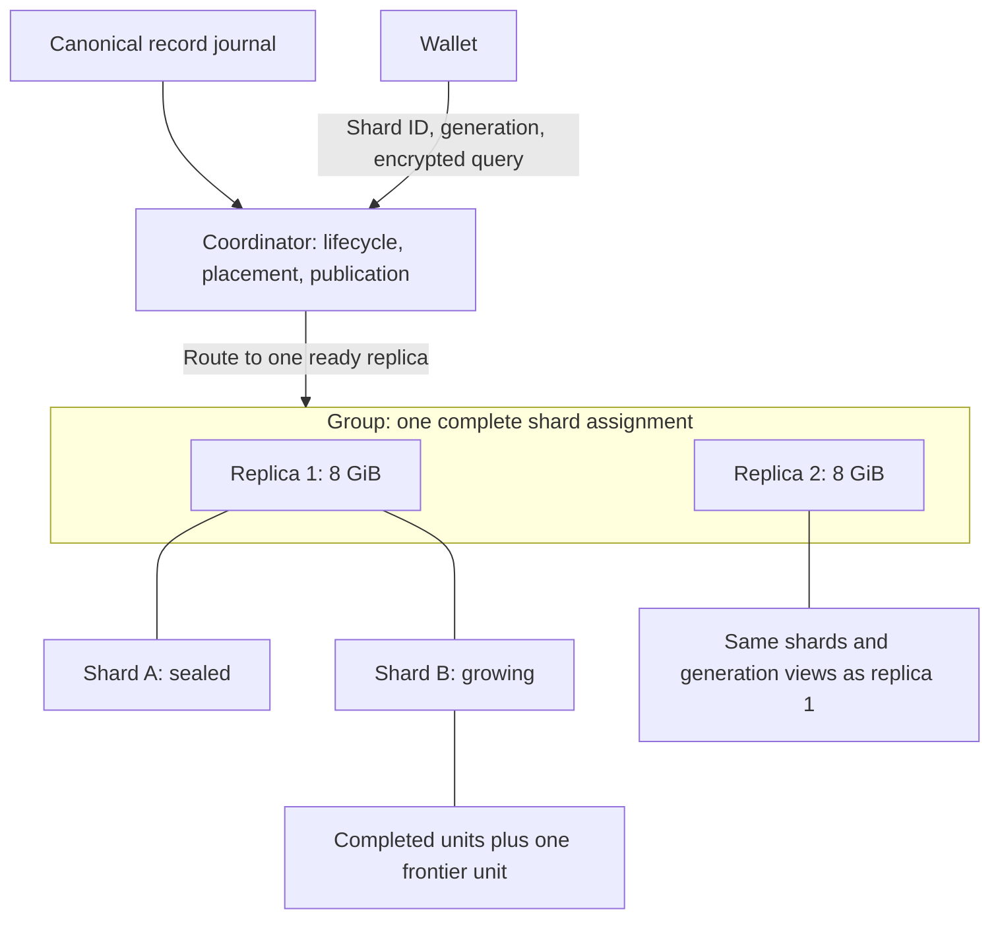
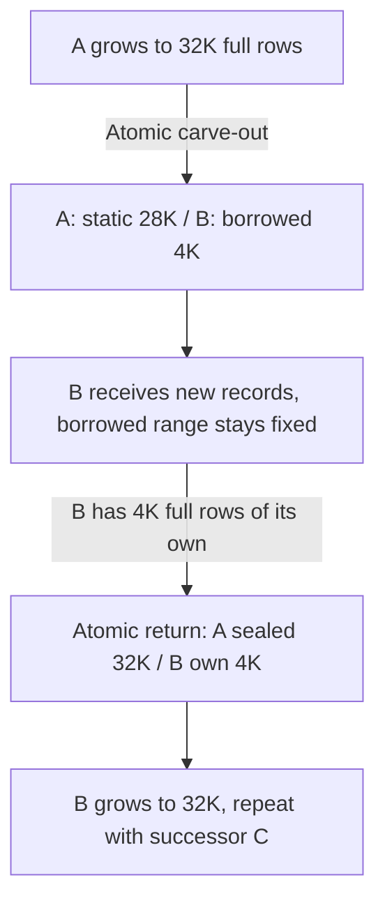
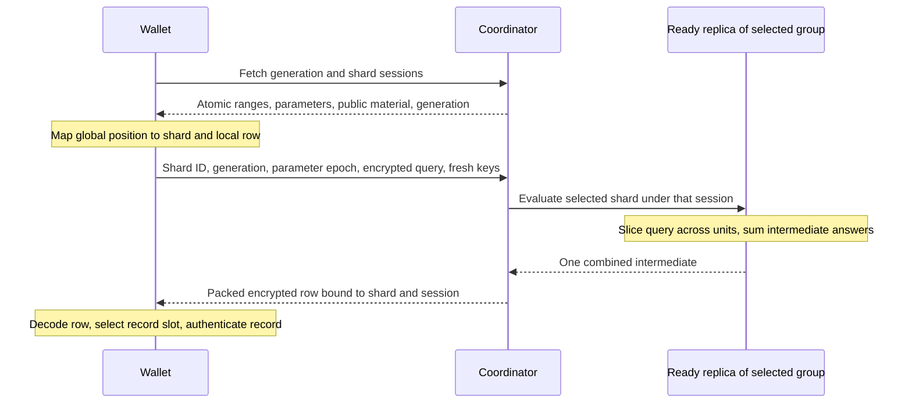
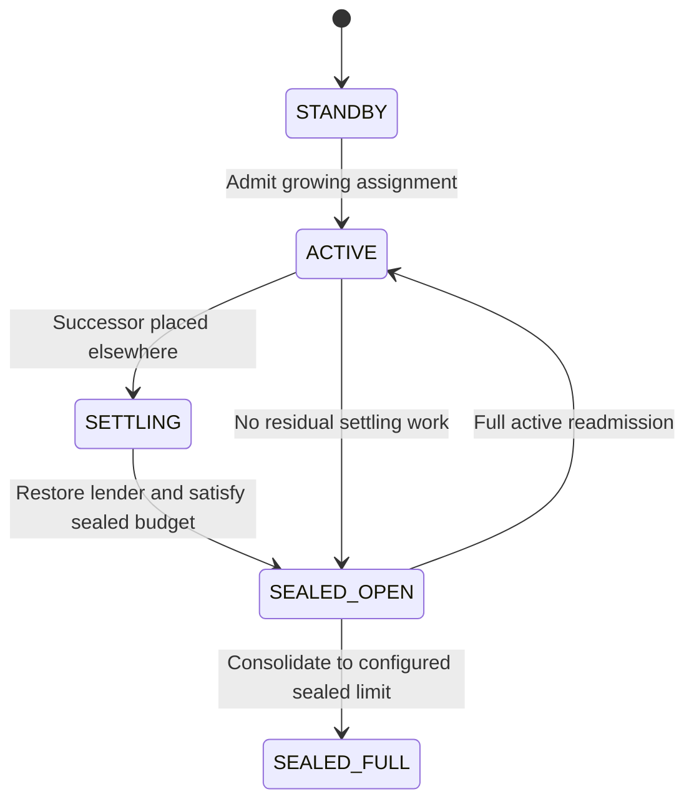
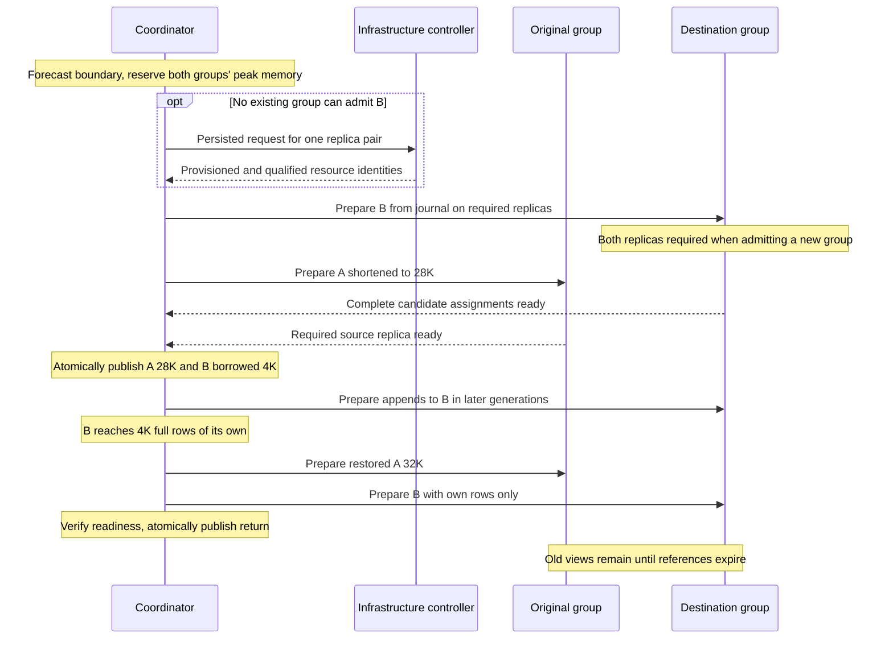
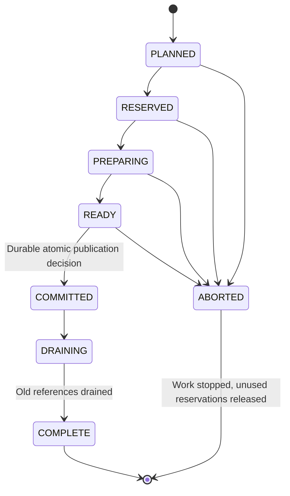

# Enhance architecture 2: shards, snapshots, and worker placement

## Scope and system model

This document specifies the target Enhance architecture. It is not a description
of deployed behavior or authorization to deploy infrastructure. The existing
implementation is described in [architecture](architecture.md) and
[protocol](protocol.md). Schema 11 uses 653-byte suffix records and protocol v5; wallet-side
authentication reconstructs the ciphertext using compact context. Relative to that protocol, this design changes the database's query domains, update granularity,
and placement, not the underlying PIR cryptography.

The coordinator ingests canonical records into a journal and publishes immutable
generations of the serving database. Each generation divides the records into
independently queried shards of at most 32K rows. A wallet publicly selects a
shard, then uses PIR to hide its row within that shard. Workers evaluate only the
selected shard, so a query does not scan the entire historical database.

Within a shard, smaller mutable units bound preprocessing and snapshot retention
costs. Completed units are shared across generations; only changed units need new
runtimes. A new shard starts by borrowing a fixed suffix of its predecessor, so
its initial query domain contains real historical records. It returns that suffix
once it has enough records of its own.

Whole shards are assigned to groups of two 8 GiB worker replicas. Each replica
holds the complete assignment. A group may hold at most five total shards while
receiving appends, or seven sealed shards after qualification (six by default). The coordinator reserves memory for
future growth and transitions, prepares new groups before capacity runs out, and
moves sealed shards into older groups to fill their qualified sealed slots. All placement
limits remain subject to measured memory admission.



### Terms and defaults

The existing code calls its internal 8K-row units “shards.” In this specification
those are **mutable units**; the existing global Enhance database is one PIR
shard. A group describes placement and replication, not a query domain.

| Term | Meaning |
|---|---|
| Record | One position-indexed Ironwood enhancement record, 653 bytes in schema 11 |
| Row | Plaintext retrieved by one PIR query: 33 consecutive records, or 21,549 bytes, in schema 11 with profile `simplepir-p16-q46-v1` |
| Shard | An independent PIR database with its own parameters, public material, and separately generated query/upload-key material |
| Upload keys | Fresh packing/evaluation keys carried with each query; they are not persistent keys reused across requests |
| Mutable unit (`mutable_unit`) | A shard subdivision controlling preprocessing, caching, and retention; all units share the shard's query domain and upload keys |
| Frontier unit | The last, partially populated mutable unit receiving appends; its physical allocation grows adaptively |
| Group | A placement unit holding one or more complete shards, each assigned to exactly one group in a given generation |
| Worker / replica | One serving process on an 8 GiB machine; each replica holds its group's complete assignment |
| Generation | An immutable, atomic view of the canonical anchor, shard ranges, parameters, unit revisions, and ready placements |
| Loan | Temporary query ownership of a full shard's fixed suffix by its successor; canonical records stay in the journal |
| Populated rows | Rows containing records; storage sizing includes a partial final row, but population thresholds count only full rows |
| Allocated rows | Rows physically materialized in a unit runtime, including zero padding |
| Logical rows | The power-of-two row dimension of a shard's encrypted query, including implicit zero padding |

Here, 1K means 1,024 rows. The defaults are:

| Parameter | Default | Meaning |
|---|---:|---|
| `max_shard_rows` | 32,768 | Maximum logical dimension and normal final populated shard size |
| `min_shard_rows` | 4,096 | Fixed loan size and successor-owned population required for return |
| `max_mutable_unit_rows` | 8,192 | Maximum unit size |
| `min_mutable_unit_rows` | 2,048 | Allocation floor compatible with preprocessing alignment |
| `records_per_row` | 33 | Schema-11 packing with 16-bit plaintext coefficients |
| Retained published generations | 5 | Includes current; one unpublished candidate is additional |
| Active group | 5 total shards | Normally four sealed plus one active; lenders also count |
| Fully sealed group | 6 shards by default; 7 after qualification | No shard receiving appends |
| Replicas per group | 2 | Alternative complete copies; their capacities are not additive |
| Worker RAM | 8 GiB | Per replica, shared with the host's other activity |

## Data layout and shard growth

### Rows and mutable units

Use validated power-of-two shard and unit size parameters, with
`2 * min_shard_rows <= max_shard_rows`. Shard splits and unit starts must respect
2,048-row preprocessing alignment. Reject parameter combinations outside the
qualified geometry family rather than silently rounding them.

For a nonempty shard containing `n` records:

```text
used_rows    = ceil(n / records_per_row)
full_rows    = floor(n / records_per_row)
logical_rows = next_power_of_two(max(min_shard_rows, used_rows))
```

For a nonempty frontier unit:

```text
allocated_rows = min(unit_capacity,
                     next_power_of_two(max(min_mutable_unit_rows,
                                           unit_used_rows)))
```

A unit normally has 8K capacity, but a shard boundary can shorten it: a 28K shard
can contain 8K + 8K + 8K + 4K units. A full unit rolls over before accepting more
records. Construct subsequent units for overflow; the `min` expression must never
truncate records. Adaptive allocation saves physical memory and preprocessing,
while the logical row count still determines the encrypted query vector's size.

Ranges are half-open global row ranges. Records retain their global row packing,
and splits occur on full row boundaries. The shard-local row is
`global_row - shard.global_row_start`. Shard IDs are stable identities, not the
result of dividing a position by a fixed shard size: a successor's start changes
when it returns its loan.

The first shard is a bootstrap exception to the minimum-population policy. It
serves available records before the database has 4K full rows; padding does not
create population. Do not publish an empty database.

### Borrowing a suffix and returning it once

Let `M = max_shard_rows`, `m = min_shard_rows`, and let growing shard A start at
global row `s`. When A reaches `M` fully populated rows, give its fixed final `m`
rows to successor B:

```text
A: [s,         s + M - m)
B: [s + M - m, s + M)       borrowed prefix
```

A stops receiving appends. B receives all new records after the borrowed prefix.
The borrowed range stays fixed throughout the loan; records are not returned
progressively. Once B has `m` full rows of its own beyond `s + M`, return the
entire prefix in one publication:

```text
A: [s,     s + M)           restored and sealed
B: [s + M, current_end)     own records only; continues growing
```

With the defaults, A lends 4K rows at 32K and seals when B has 4K full rows of its
own. “Sealed” means unchanged under ordinary appends, not immune to a reorg.

| State | A populated rows | B populated rows | A / B logical rows |
|---|---:|---:|---|
| Before split | Up to 32K | — | Up to 32K / — |
| Loan starts | 28K | Borrowed 4K | 32K / 4K |
| 1K new rows arrive | 28K | Borrowed 4K + own 1K | 32K / 8K |
| Own 4K reached, before return | 28K | Borrowed 4K + own 4K | 32K / 8K |
| Loan returned | 32K, sealed | Own 4K | 32K / 4K |
| Further growth | 32K, sealed | Own 4K through 32K | 32K / 4K through 32K |



```text
Global rows relative to A's original start:

                  0                 28K      32K      36K
Before split      [----------- A ------------)
Loan active       [-------- A -------)[ B borrowed ][ B new ... ]
After return      [----------- A ------------)[---- B own -----)
```

Every published generation must cover all populated records exactly once, with
no overlapping query ownership. Borrowed records route through B during the loan
and A after return. Extra physical copies retained for old generations do not
create alternative routes in the current generation.

Apply lifecycle transitions to complete canonical blocks. A crossing block may
contain excess records or a partial final row; preserve them all and publish one
coherent result. Return requires `m * records_per_row` successor-owned records.
The coordinator may skip publishing the threshold's pre-return state and publish
the post-return state at the same anchor. If a batch crosses several boundaries,
process them in order before publication. No published shard may exceed `M`
logical rows, and no part of a block may be dropped or deferred to hit a boundary.

### Preprocessing and reuse

Units are subdivisions of one query domain. Each uses the corresponding slice of
the shard's public query setup, with compatible column width, moduli, and
cryptographic parameters. Sum the units' preprocessing contributions to produce
the shard's published contribution. Different unit sizes do not justify unrelated
setups or separate queries.

Reuse completed units only when content and geometry match. Carve-out changes
A's final unit and creates B's local database. Return restores A and removes B's
prefix, changing B's local indices. Rebuild affected preprocessing: identical
record bytes are insufficient for reuse at a different offset or under another
setup. These are bounded boundary transitions, not per-block sliding rebuilds.

Cache and artifact identity must bind the table, shard ID, local offset,
allocated dimensions, setup/parameter identity, and content digest. Unit identity
alone cannot distinguish valid reuse from an incompatible carve-out, return, or
rollback.

Retaining A's full-size artifacts on disk can speed restoration when geometry,
setup, content, and canonical-chain checks all match. This is optional and does
not require keeping both versions in RAM. Preserve streamed, disk-backed
publication artifacts; retaining a query runtime must not imply retaining its
entire CRS in memory.

## Queries and published snapshots

### Query routing and the privacy boundary

A wallet fetches one atomic generation, maps its global position to a shard and
local row, and constructs a query for that shard's session. The coordinator sends
it to one ready replica of the assigned group. That replica evaluates every
populated unit in the selected shard, sums the intermediate answers, and returns
one combined intermediate for response packing. Unit padding and unallocated
logical zero rows contribute zero.



Replica answers are alternatives, not additive contributions. Generate fresh
randomness and packing keys once per query, not once per unit. At a fixed row
format and compatible parameters, unit subdivision changes neither intermediate
width nor response packing. It also does not shorten the logical query vector.

Requests and responses bind the generation, shard, and parameter epoch. Never
interpret a local row index or answer under a different session. A wallet needing
several shards prepares separate queries; deduplicate rows only within the same
shard session.

The server can observe the selected shard, generation, request timing, and request
count. Hiding the row within that domain relies on the existing PIR scheme and
its assumptions. This deliberately changes whole-database position privacy.
The 4K initial population contains 135,168 actual records, but is a population
policy rather than a proven anonymity guarantee. Public chain information,
uneven access probabilities, and correlations across requests or transitions can
narrow the possible targets.

Real and dummy requests within a shard have identical formats. This design does
not prescribe a wallet traffic-cover schedule or conceal shard selection.
Public-parameter digests establish consistency, not canonical-chain authenticity;
wallets must still authenticate records and assess the chain anchor.

### Manifest, publication, and retention

A generation manifest describes the complete answerable view:

| Manifest content | Required fields |
|---|---|
| Chain coverage | Canonical anchor and global record coverage |
| Shard | Stable ID, global range, used/logical rows, lifecycle state, complete query session or a reference bound to it |
| Loan | Lender, borrower, fixed borrowed range, return threshold |
| Mutable unit | Shard-local range, allocated rows, content and geometry identity |
| Placement | Each shard's assigned group and ready replicas |

Finalize endpoint names and binary framing with the versioned protocol. The
existing single global session and fixed-size internal shard descriptors cannot
be silently reinterpreted as this model.

Before publishing, prepare affected runtimes and public parameters, verify the
canonical anchor, and activate ready assignments. Every required group needs at
least one ready replica holding its complete candidate assignment. New-group
admission and elective consolidation require both destination replicas ready.
An ordinary update to an established group may publish with one ready replica,
but must report degraded replication. Failed preparation leaves the previous
generation available. Carve-out and return publish both shards atomically; never
combine one side's new range with the other side's old range.

Retain the five most recent published generations, including current, plus one
unpublished candidate. On successful publication, the candidate becomes current
and the oldest published generation leaves the window. Sessions within the
window keep their original ranges, runtimes, routing, and parameters. Requests
outside it receive an explicit expired-session response and must refresh; their
queries must never be reinterpreted under current geometry.

Already admitted queries may pin runtimes beyond that window until completion.
Count these pins in memory admission and defer preparation if necessary. Normal
preparation has five published views plus one candidate, but this does not bound
all live runtime revisions to six. Bound query lifetimes and concurrency so pins
cannot accumulate indefinitely. Five generations is a count, not a wall-clock
TTL: the time available to refresh depends on publication cadence.

Persist lifecycle and placement consistently with the manifest. Restart must not
repeat a loan or restore only one side. Reorg recovery reconstructs lifecycle
from canonical coverage, undoing carve-out or return where necessary. Generation
IDs remain monotonic. Retained sessions preserve their snapshots even through
recovery; wallets still decide whether an anchor is acceptable.

## Worker capacity

A shard belongs wholly to one group in each generation. Replace fixed “three
internal shards per group” arithmetic with explicit placement and memory
admission. Both replicas must independently fit the assignment, retained
revisions, preparation, transitions, serving overhead, and operating headroom.

The encoded schema-11 database has 12,288 `u16` columns: 24,576 bytes per row,
compared with 21,549 bytes of record payload. A full 32K database is 768 MiB;
an 8K unit is 192 MiB. These sizes explain the base storage cost, not the full
worker peak. Sharing unchanged units between generations is essential; retaining
whole-shard copies for every snapshot would defeat the budget.

### Five-generation placement model and memory estimates

The selected policy is five total shards with at most one receiving appends,
or seven sealed shards after qualification (six by default), per replica. These are alternative roles, not additive
capacities. Maximum unit size stays at 8K; no separate 4K frontier cap is required
by the selected model. A sealed group must pass active admission before it can
receive appends again.

The current database already contains one frontier revision. Five published
generations plus a candidate can require six versions of the changing unit, so
budget five additional 8K revisions:

```text
active group database budget = 5 * 768 MiB       current full shards
                             + 5 * 192 MiB       extra frontier revisions
                             + 4 * 192 MiB       modeled transition allowance
                             = 5,568 MiB = 5.4375 GiB

sealed group database budget = 7 * 768 MiB
                             = 5,376 MiB = 5.25 GiB
```

The shared placement policy fixes active groups at five total shards and supports
six or seven sealed shards. The CLI defaults to six. Select `--sealed-shards 7`
on the coordinator, workers and exercise command only for isolated qualification
or an independently qualified deployment. Persisted group/worker policy and
reservation requests bind this selection; restart with a different policy is
rejected. A group containing a lender is still subject to the active limit.

The [historical capacity report](../evidence/schema9-worker-capacity-2026-09-22/REPORT.md)
measured seven sealed shards at 5.945 GiB on an isolated larger host with a worker
cgroup. It does not qualify schema 11 or actual 8 GiB hosts. Using the runtime's
728 MiB preparation/process/kernel allowance gives these planning estimates:

| Placement | Database subtotal | Estimated resident + kernel | Margin after 512 MiB guard below 7 GiB |
|---|---:|---:|---:|
| Five total with active frontier | 5,568 MiB | 6,296 MiB | 360 MiB |
| Six sealed | 4,608 MiB | 5,336 MiB | 1,320 MiB |
| Seven sealed | 5,376 MiB | 6,104 MiB | 552 MiB |
| Six total with active frontier | 6,336 MiB | 7,064 MiB | Fails |
| Eight sealed | 6,144 MiB | 6,872 MiB | Fails |

The active subtotal includes five extra frontier revisions and a 768 MiB
transition allowance. Sealed estimates assume unchanged databases; transitions,
reorgs and query pins require additional byte admission. Both replicas must fit
independently. Never count a source allocation as freed until retained snapshots
and admitted queries release it. A reorg reopening a packed sealed group must
relocate assignments before publishing; if admission fails, preserve the previous
answerable generation and report blocked progress.

Both 737-byte and 653-byte rows require six PIR instances and 12,288 `u16`
columns. The 11.4% raw storage reduction does not reduce the 768 MiB full-shard
query database or imply smaller encrypted responses. Seven sealed shards store
7,569,408 record positions per pair, 16.7% more than six; replica capacities are
not additive. Active capacity and first-pair expansion timing do not increase.

See [capacity qualification](capacity-expansion.md) for the hardware gate,
fallback and evidence requirements. Keep the guard and host reserve unchanged.

### Memory limits and admission

The target soft limit is 7 GiB on an 8 GiB machine. Admission must preserve the
512 MiB resident guard and fit the qualified total-memory and reclaim behavior.
Account for transient CRS construction and cgroup-charged artifact cache, not
just query databases. In the existing tests, file cache reached MemoryHigh;
resident estimates below 7 GiB do not establish zero pressure or acceptable query
latency under reclaim. Qualify these on an actual 8 GiB host. Historical tests of
the previous layout do not qualify this architecture.

The service also needs a hard cap below usable host memory, after measured
allowance for the kernel and other services. A 7.5 GiB cap would nominally leave
512 MiB outside the service on an 8 GiB host, but remains a candidate until host
overhead is qualified. That host allowance is separate from the resident guard
inside the 7 GiB soft limit. Space above the soft limit is emergency spillover;
neither it nor swap counts as placement capacity. Verify actual host RAM rather
than assuming a provider's “8 GB” means 8 GiB.

The existing service template remains at 6 GiB soft / 7 GiB hard. Limits and
retention change only after implementation, qualification, and explicit rollout;
this specification does not change deployed settings.

The coordinator plans capacity and each worker independently checks admission.
Its reservation ledger accounts for:

```text
distinct live runtimes, including retained snapshots and admitted query pins
+ incremental runtimes needed at peak preparation
+ outstanding growth and transition reservations not already counted above
+ bounded publication, query, networking, and process overhead
+ qualified operating headroom
```

Count a shared runtime once. As reserved capacity is materialized, consume that
reservation rather than charging it twice. Never credit future reclamation
before references actually drain. Concurrent operations must fit together or
have their preparation explicitly serialized. Each replica has its own budget;
current RSS and shard count alone are insufficient admission tests.

Initially allow one preparation operation per worker under the measured
two-evaluation workload. Foreground publication, loan return, required successor
preparation, and recovery take priority over consolidation. Queue or safely abort
an uncommitted move when necessary. Cancellation releases neither its memory nor
its slot until the work has actually stopped. Bound preparation/query buffering,
query concurrency, and query lifetime as part of qualification; an execution
slot alone does not bound queued request bodies.

## Placement, expansion, and consolidation

### Ownership and group roles

The coordinator's placement controller decides assignments and reservations.
The infrastructure controller supplies machines for those decisions. Workers
prepare what they are assigned and report readiness; they neither move shards
independently nor request infrastructure.

| Component | Responsibility |
|---|---|
| Coordinator placement controller | Reconcile lifecycle and capacity, choose placements, reserve memory, request expansion and consolidation |
| Infrastructure controller | Provision and bootstrap the requested replica pair, persist resource identities, report readiness or failure |
| Worker | Enforce local admission, prepare exact assigned runtimes, acknowledge readiness, serve generation-bound queries |
| Coordinator generation publisher | Atomically commit ranges, sessions, placements, and the associated operation result |

Use one authoritative placement writer and a durable controller epoch to fence
stale writers. Infrastructure operations retain their own serialized journal and
locking; a placement epoch does not serialize infrastructure state changes.
Growing from one group to two means growing from two machines to four. Seven sealed
shards per worker means seven distinct shards per group, copied onto both replicas.

Group role describes the current assignment and its remaining transition work.
Replica health is tracked separately.

| Role | Meaning |
|---|---|
| `STANDBY` | No current shards; ready for an admitted assignment |
| `ACTIVE` | At most five current shards, at most one receiving appends |
| `SETTLING` | No appending shard, but restoration or residual active reservations prevent sealed-role admission |
| `SEALED_OPEN` | Fewer than the configured sealed limit of current shards, all sealed; may accept consolidation after memory admission |
| `SEALED_FULL` | Configured sealed limit (six or seven), all sealed |



The diagram shows ordinary growth, not all recovery paths. Reorgs can require
replanning roles. A role change never discards retained runtimes. Even a group
with no current shards remains charged for undrained references.

A 28K lender is not sealed; it counts toward the active limit and keeps its
restoration reservation. Count both lender and borrower when they share a group:

```text
3 sealed + A growing                       = 4 shards
3 sealed + A lending + B receiving appends = 5 shards: eligible if memory fits
4 sealed + B growing, after return         = 5 shards

4 sealed + A growing                       = 5 shards
4 sealed + A lending + B receiving appends = 6 shards: forbidden on one group
```

The second case requires a different destination for B. The transition allowance
does not waive the five-shard limit or duplicate B's growth reservation.

### Reserving and preparing a successor

When admitting successor B, reserve its full growth through 32K and the work it
will eventually require as a lender: carve-out and restoration. This does not
reserve space for all future successors; B's own successor can go elsewhere.

During B's incoming loan, it can contain `2 * min_shard_rows` populated rows:
4K borrowed plus 4K new with the defaults. That 8K is data population, not the
complete memory requirement. Its destination must also fit retained revisions,
preparation, return-time overlap, and serving overhead. After return, B's own-only
runtime may coexist with old runtimes containing its borrowed prefix. A's source
group must separately fit its shortened view, retained snapshots, and restoration
to 32K. Carving out 4K does not immediately free that RAM.

Reconcile placement on each committed canonical block, readiness change, and
periodic timer. Prefer an existing group whose role, shard count, and full
reservation fit; otherwise prepare a new pair. Start provisioning before the
predicted boundary:

```text
remaining rows before carve-out
    <= conservative row growth rate * readiness lead time
       + burst allowance
```

Measure growth, burst allowance, and readiness time operationally. Readiness
includes provisioning, bootstrap, qualification, data preparation, and retries.
Use a conservative configured fallback when growth observations are stale or
missing; absence of data must not imply zero growth. Reevaluate on each
observation and trigger immediately if reservations reveal an earlier limit.
Persist one expansion operation per successor identity and reconcile recorded
resources after retries or restart rather than creating another pair.

The destination must be ready before the boundary-crossing generation publishes.
Build B directly from the canonical journal on that destination; do not require
a temporary B runtime on the constrained source. Borrowing changes query
ownership, not the journal's physical record ownership. Expansion leaves existing
historical shards in place.



Provision and qualify both new replicas and require their complete candidate
assignments ready before admitting a new group. A preparation path that skips
directly to post-return state still needs a qualified reservation for transition
work and excess records. If a block crosses several boundaries, reserve every
required destination before publishing its generation.

If provisioning fails, readiness is delayed, or the fleet ceiling is reached,
keep the last answerable generation and report blocked publication and lag.
Do not exceed a worker budget or publish an oversized shard. Journal ingestion
may continue within its independent storage limits; resume publication from
canonical coverage once capacity is ready.

### Filling historical groups to the qualified sealed limit

Rollover alone leaves a formerly active five-shard group with five sealed shards.
Consolidation fills the remaining qualified slots by moving shards after they seal elsewhere.
This is routine placement work; moving an active shard remains exceptional.

After sealing, choose the oldest eligible `SEALED_OPEN` destination by persisted
group creation sequence. Prefer newly sealed shards from the active group, then
eligible sealed shards from newer groups in stable shard-creation order. Move
only toward older groups with vacant sealed slots, avoiding oscillation. Do not
reopen a full historical group for active growth merely to improve utilization,
or provision a group solely for elective consolidation.

Reserve destination capacity, prepare the shard on both replicas, and verify
content and session parameters. Publish the placement change atomically once the
destination's complete resulting assignment is ready. Preserve the shard ID,
range, and query setup. Source routes and runtimes remain for old generations and
admitted queries; the move frees source memory only after those references drain.

| Stage | Group 1 | Group 2 |
|---|---|---|
| Before expansion | S1–S4 sealed; S5 growing | Preparing |
| S5 lends its suffix | S1–S4 sealed; S5 lending | S6 receiving appends |
| Loan returned | S1–S5 sealed | S6 growing |
| S6's loan to S7 returns | S1–S5 sealed | S6 sealed; S7 growing |
| Move S6 and drain old references | S1–S6 sealed | S7 growing |

Each assignment appears on both replicas. The move fills group 1 without ever
admitting a sixth shard into an active group. Once eligible transitions and moves
drain, historical shards should occupy groups of six, allowing a partially filled
historical group and capacity reserved for active growth. Health, memory, and
retained references can delay this convergence; report the blocking reason.
The maximum shard count on every worker at every moment is not a requirement.

## Worker updates and recovery

### Persisted update protocol

Every placement operation records its operation ID, controller epoch, expected
placement revision, affected shard IDs, source/destination groups, canonical
anchor, candidate manifest digest, per-replica reservations, and phase. Expansion
also records infrastructure operation and resource identities. Finalize RPC names
and encoding during implementation while preserving these semantics.

| Phase | Required action |
|---|---|
| `PLANNED` | Persist the intended transition and expected placement revision |
| `RESERVED` | Reserve every affected worker's budget; reconcile or release partial reservations, which cannot authorize preparation |
| `PREPARING` | Build missing runtimes without changing published ones |
| `READY` | Collect acknowledgments for the exact candidate digest and complete assignments; satisfy publication readiness |
| `COMMITTED` | Atomically persist manifest, placement revision, and operation result before exposing the generation |
| `DRAINING` | Preserve old routes and runtimes while retained generations and admitted queries reference them |
| `COMPLETE` | Release obsolete runtimes and unused reservations |



Before commit, failure or cancellation may abort the operation without changing
the published generation. After commit, recovery follows the durable decision;
it must not silently restore the previous placement.

If normal publication advances while a move is preparing, rebase the plan onto
the next single candidate using a new persisted attempt ID. Revalidate canonical
content, reservations, and readiness. Never commit a stale manifest or retain a
second unpublished candidate for consolidation. Prefer combining a move with the
next normal publication. A placement-only publication has the same five-generation
expiry semantics; do not generate publications merely to evict sessions faster.

Commands are idempotent by operation ID, attempt ID, command kind, and payload
identity. Reject conflicting payloads under the same key, stale controller
epochs, stale placement revisions, and readiness from a previous worker process
incarnation. Fencing prevents stale mutations and reclamation without invalidating
queries for legitimate retained generations.

After restart, workers persist or safely reconstruct reservations and prepared
inventory before reporting readiness. The coordinator reconciles their state and
infrastructure resource identities with its durable journal instead of blindly
repeating allocations.

### Draining and exceptional recovery

Reclaim a runtime only when no retained generation, candidate, admitted query, or
unfinished operation references it. Expiry first stops new queries against that
generation, then lets admitted queries drain. A draining operation releases its
source pin after old-generation and query references disappear; the existence of
its journal record must not keep the pin alive indefinitely.

Reconcile references before garbage collection after restart. A lost heartbeat
or coordinator connection never authorizes deletion of a published runtime.
Delayed queries remain charged and can defer further preparation.

When an active shard must move, prepare the whole shard on a destination with its
full qualified reservation, verify generation-specific content and parameters,
and switch placement atomically. As with consolidation, source and destination
need simultaneous capacity until old references drain. Growth reservations should
make this exceptional.

| Failure | Response |
|---|---|
| Provisioning delay or fleet ceiling | Preserve published service; block publication when reserved capacity is exhausted |
| Destination preparation failure | Retry or abort before commit; preserve source placement |
| Destination replica fails before elective consolidation commits | Wait for complete destination replication to recover |
| Coordinator crashes around commit | Recover the durable decision and reconcile participants |
| Old queries delay reclamation | Keep charging their runtimes; defer conflicting work |
| Reorg invalidates an uncommitted candidate | Discard it and replan from canonical coverage |
| Reorg changes a full sealed group | Readmit the changed workload; relocate into qualified capacity or block publication |
| Actual memory exceeds the qualified model | Stop new admissions, report the discrepancy, preserve published service where possible |

Seven sealed shards is a steady-state target, not a guarantee that arbitrary
changes to all seven fit at once. Reserve actual recovery runtimes, including
retained-snapshot overlap, before preparing. If one shard cannot qualify even
alone, the design or implementation must be corrected; splitting it across
groups or silently raising memory limits is not a fallback.

## Implementation and qualification

Introduce explicit types for shard/query domain, mutable unit/preprocessing unit,
and group/replicated placement. Update clients, coordinator, workers, protocols,
persistence, metrics, and the capacity controller together. Version public
geometry and affected artifacts; legacy clients must reject incompatible
sessions. Preserve the canonical journal and rebuild derived artifacts as needed.
Deployment remains a separate operation.

Qualification must cover the following behavior, not just shard counts:

| Area | Required evidence |
|---|---|
| Geometry | 2K/4K/8K adaptive units, shortened boundaries, power-of-two logical padding, partial rows, empty bootstrap, overflow-safe bounds |
| PIR equivalence | Unequal-unit evaluation and summed preprocessing match a monolithic shard; check first/last rows, unit boundaries, borrowed/new records, dummy queries, and implicit zero padding |
| Lifecycle | Before/at/after 32K carve-out and 4K-owned return; excess records in crossing blocks, multiple transitions per batch, repeated cycles; complete disjoint coverage and no published query dimension over 32K |
| Session binding | Old queries survive carve-out, growth, return, and moves; reject wrong shard, generation, epoch, dimensions, and framing; prevent incompatible cache reuse; enforce five-generation expiry and safe admitted-query completion |
| Recovery | Restart and reorg on both sides of transitions, failed preparation/provisioning, one failed replica, interrupted return |
| Memory and performance | Full shard alone, five-total active and seven-sealed placements, real carve-out/return overlap, consolidation, reorgs, and delayed source reclamation on 8 GiB hosts |
| Privacy and routing | Borrowed records route through the borrower; no target-dependent alternative current domains; document shard selection and transition correlation without treating 4K as a cryptographic guarantee |
| Rollover | Same-group and new-group successors, `2 * min_shard_rows` loan reservation, restoration with retained snapshots, growth through 32K, direct destination preparation, early provisioning, delayed readiness, burst crossings, fleet limits, exceptional active moves |
| Consolidation | Several group boundaries converge toward the configured sealed limit where eligible; active groups never exceed five; verify lender counting, settling, source retention, destination replication, and publication priority |
| Operation recovery | Restart at every phase and around commit; reject stale epochs, revisions, process incarnations, and conflicting idempotency payloads; no duplicate provisioning, partial commit, second candidate, or premature reservation release |

Run memory qualification beyond the retention window with five published
generations plus a candidate, concurrent traffic, and the test harness off-host.
Preserve the 512 MiB resident guard and verify the derived overhead allowance.
Record peak cgroup memory, memory events, swap, publication latency, query latency,
and exact-answer correctness. Idle steady-state measurements do not qualify
transition reservations.

Operational metrics must expose per-shard populated/logical rows and loan state,
per-unit allocated rows, retained runtime bytes, per-group admitted/reserved
memory, remaining capacity before carve-out, growth/readiness forecasts,
publication lag, and expansion readiness. Report group role separately from
replica health, and expose placement revision, operation phase, consolidation
backlog and blocked reason, sealed-slot occupancy, and bytes awaiting source
reclamation. Keep per-query target positions private.

This specification fixes the logical policy. Safe packing counts still require
qualification of the selected model; provisioning lead time requires operational
evidence, and the versioned wire encoding remains implementation work. Existing
deployment constants do not establish any of those results.

## Pinned wallet fleet ceiling

PR #28 at `de3ec78f31b6fd184596fc952fe4f78d3a63cd0a` validates at most
24 query shards. Keep that protocol ceiling independent of placement policy.
At an exact full-shard boundary the lifecycle opens a successor, so publication
must stop before `24 * 32768 * 33` records (25,952,256). The last compatible
record count is 25,952,255; do not advertise the placement-only 26-span capacity.

| Replica groups | Six-sealed next blocked boundary (full-shard spans) | Seven-sealed next blocked boundary |
|---:|---:|---:|
| 1 | 5 | 5 |
| 2 | 11 | 12 |
| 3 | 17 | 19 |
| 4 | 23 | 24 (wallet protocol ceiling) |

These are count forecasts, subject to earlier memory refusal and advance
provisioning. Raising the protocol ceiling requires a separately coordinated
wallet change; denser placement does not authorize it.
