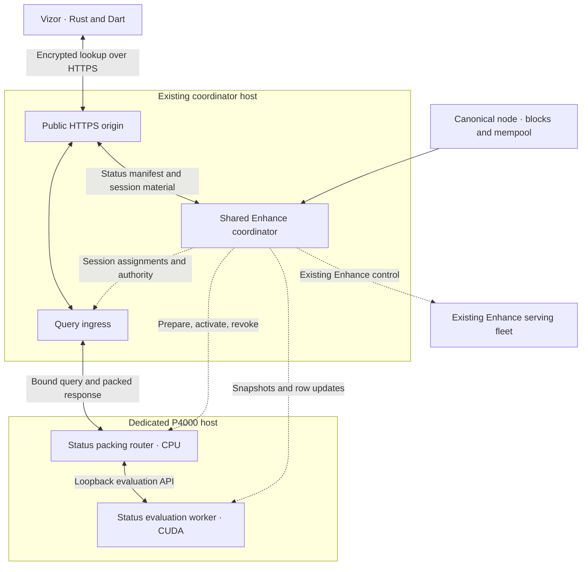

# Status PIR architecture

Status: private compact v2 deployment; public production qualification pending.

An isolated [synthetic backend](status_backend.md) implements the index and encrypted HTTP
path for synthetic fixtures. Its preparation baseline, deployment commands, and
remaining production boundaries are documented separately. The
[distributed live topology](status_distributed.md) and
[v2 production measurements](../evidence/status-compact-v2-2026-09-25/README.md)
track the current implementation and release blockers.

Status PIR privately observes transactions through the Enhance infrastructure.
It shares the Enhance coordinator and public ingress, with a separate status
index and a dedicated GPU host running both the packing router and evaluation
worker. The wallet supplies a transaction ID locally and receives `NotFound`,
`Mempool`, `Mined(height)`, or `Forked`, without disclosing that ID in a network
request or retrieving transaction bytes.

The initial index has exactly 8,192 rows in one query domain. It covers all
transaction types in a rolling range of recent complete blocks, the current
mempool, and retained fork observations. It does not cover all chain history.
An index miss outside established coverage is an inconclusive error, never a
successful `NotFound` observation.

The deployment must sustain 20 complete private lookups per second while making
source observations available within twenty seconds. These are joint rollout
gates, not established capabilities of the existing code or P4000 hardware.

## Relationship to GetStatus and Enhance

The proposed lightwalletd `GetStatus` RPC separates observation from payload
retrieval but still discloses the queried txid. Status PIR extends that privacy
boundary: the wallet resolves a txid to an encrypted row selection locally.
The unary lightwalletd proposal remains a separate protocol and is neither a
prerequisite nor a fallback for Status PIR.

The existing [Enhance architecture](architecture.md) separates publication,
query ingress, CPU packing, and worker evaluation. Status reuses those roles
and their control mechanisms. It needs a new index because Enhance records
are keyed by Ironwood action position and contain no txids.

| Concern | Decision |
| --- | --- |
| Coordinator | Shared authority and process, with an independently scheduled status controller |
| Chain source | Shared authenticated node connectivity and network identity |
| Database | Separate status journal, snapshots, sessions, and recovery state |
| Query domain | One fixed domain of 8,192 rows; no partition selector |
| Serving host | Separate P4000 host, colocated CPU router and CUDA worker |
| Replication | One status router and one status worker for the initial deployment |
| Wallet | Vizor Rust and Dart integration; no Swift changes in this work |
| Payload retrieval | Explicitly separate API, restricted to documented payload-required flows |
| Fallback | No automatic public `GetStatus` or `GetTransaction` fallback |

Compact scanning, broadcast, PIR enhancement, transparent previous-output
resolution, and transaction-status persistence retain their existing roles.
Status failure never authorizes payload retrieval for protected Ironwood
enhancement.

## Topology and ownership



The coordinator owns ingestion, coverage, generation identity, publication,
placement, and revocation. Ingress routes exact sessions without decoding the
PIR query. The router validates and decodes the encrypted request, obtains the
worker intermediate, validates its binding, and packs the result. The worker
evaluates the selected generation on the GPU.

Router and worker are separate processes and systemd services, with independent
admission and resource limits. Their shared host does not introduce a new
non-collusion assumption: both already belong to the service's trust boundary.
Their control interfaces require authenticated private connectivity from the
coordinator; the evaluation API is bound to loopback. Only public client routes
are exposed through the existing HTTPS origin.

Status ingestion and preparation use bounded queues and execution budgets.
Backfill, a failed status publication, or GPU unavailability must not stall
Enhance publication or recovery. Shared authority does not require both products
to publish at the same height or in the same transaction. Each manifest binds
its own anchor, and wallets validate it independently.

There is no initial status replica. Host failure makes Status PIR unavailable.
The shared coordinator and origin are also availability dependencies. The wallet
preserves state until service recovery; high availability is outside this release.

## Privacy and trust boundary

PIR hides the selected row under the assumptions of the selected PIR profile.
All requests address the same domain and have the same shape for that profile.
Requests contain no plaintext txid, txid hash, bucket number, or row selection.
The full txid is present inside the privately retrieved row and is compared
locally. Coarse hash-partition leakage is not part of this design.

The service still observes client connectivity, timing, query count, protocol,
and session identity. This design does not hide transaction broadcast, wallet
network identity, or correlations with other services. Existing Tor/direct
policy continues to apply.

The default build uses the non-native q48 PIR profile and CUDA implementation
(`status-pir-v2-q48`), with status-specific setup and transcript domain
separation. Do not inherit Enhance protocol identifiers, setup tags, or cached
material.

Building with `native-reinspiring` selects `status-pir-v3-native-two-mask-m29`
instead. It uses the Enhance native packing parameters (d=2048, q=2^54, p=2^16,
two-limb Gaussian) through ipir-sp's two-mask output. Its query masks and
packing setup come from separate `status-pir/v3/native-setup` and
`status-pir/v3/native-packing` domains, and queries use the `SPN1` magic. Per
query, the client uploads a 27,648-byte packing key and a 50,176-byte selection
and receives 16,896 response bytes. The session's public material is 44,544
bytes: two 29-bit rounded masks per column.
Hints use exact products modulo 2^54, so sparse incremental updates still apply.
The independent wallet library implements only q48. The native profile is
tested with the in-repo client.

The native profile is experimental. The
[native packing trial](../evidence/reinspiring-production-trial-2026-09-25/README.md)
and ipir-sp record open cryptographic gates. The two-mask 29-bit correctness
certificate covers only ipir-sp's recorded fixture, not the Status geometry.
Reuse of implementation code does not itself qualify the status protocol:
independent vectors and protocol review are release gates.

An authenticated response is a server assertion. PIR does not prove that a
mempool is complete, that absence is globally true, or that returned chain
metadata is honest. Wallet anchor acceptance supplies chain context. Compact v2 records carry no
block hash or transaction-inclusion proof; hashes remain in source checkpoints
and publication anchor validation. `NotFound` means no
observation in the declared, sufficiently fresh coverage, never proof that a
transaction was not broadcast.

## Index layout and coverage

### Geometry and record encoding

The index uses an 8,192-row PIR geometry with 6,144 u16 plaintext
coefficients per row. Each row contains 256 slots of 40 bytes, or 10,240 logical
bytes. All remaining bytes through the 12,288-byte coefficient row are zero.
The fixed width is independent of actual occupancy and returned state.

| Slot offset | Bytes | Field |
| --- | ---: | --- |
| 0 | 32 | Txid in protocol byte order |
| 32 | 1 | Tag: 0 empty, 1 mempool, 2 mined, 3 forked |
| 33 | 3 | Reserved, zero |
| 36 | 4 | Height, unsigned little-endian |

An empty slot is entirely zero. Mempool slots have zero height. Mined and forked slots have a positive u32
height. Canonical and disconnected block hashes remain server-only source
metadata. Unknown tags, nonzero reserved bytes, invalid
state/height combinations, and nonzero row padding are malformed responses.
No raw transaction bytes are stored in these records.

Map the txid to a row with SHA-256 over the literal domain tag
`status-pir/v2/bucket\0`, the 32-byte network genesis hash, a 32-byte published
index salt, and the 32-byte protocol-order txid. Interpret the first two digest
bytes as a little-endian u16 and mask to the low 13 bits (`& 8191`). Sort occupied slots
lexicographically by protocol-order txid bytes, followed by empty slots. Compare
full txids after decryption; hash equality is not identity equality.

Keep the salt stable across ordinary updates. A salt change rebuilds the index
and changes session identity. It must never be used as an unbound routing hint.
Maintain one record per txid, with precedence `Mined` over `Mempool` over
`Forked`. For multiple retained disconnected observations, choose the greatest
height, breaking equal-height ties lexicographically by block hash bytes.

There are 2,097,152 physical slots. The initial admission limit is 75% occupancy,
`8192 * 256 * 3 / 4 = 1,572,864` entries, and every row must also fit
its 256 slots. Enforce this integer limit across all retained states combined,
not separately for mined, mempool, and forked entries. This is a capacity
ceiling, not a promised retained duration. Actual retention depends on chain
volume, mempool size, fork observations, and collisions.

Allocated slot storage is 80 MiB; the padded u16 PIR database is 96 MiB.
Active and candidate database arrays therefore total 384 MiB before hints,
packing material, device-specific allocations, request buffers, and pinned
resources. These are layout sizes, not measured process or GPU memory limits.

At the selected 75% ceiling the average bucket contains 192 entries, with an
approximately 3.7% chance of at least one overflowing bucket under the
uniform-hash model. Start with this ceiling and reduce actual retained occupancy
only when the per-bucket checks require further complete-block eviction. There
is no automatic switch to a fixed 60% ceiling and no predetermined decrement;
stop evicting as soon as the global and per-bucket limits both hold.

For comparison, at 60% occupancy the average bucket contains approximately 153.6 entries.
For `N = 1,258,291` independently and uniformly hashed txids, a bucket's
occupancy has distribution `X ~ Binomial(N, 1/8192)`. The probability
`P(X >= 257)` is approximately `1.7344e-14`. Applying a union bound across
8,192 buckets gives at most `1.4209e-10` probability of any bucket overflow,
roughly one in seven billion snapshots. This bound does not require independent
bucket occupancies.

| Occupancy | Entry ceiling | Probability of any bucket overflow |
| --- | ---: | --- |
| 60% (comparison only) | 1,258,291 | At most approximately `1.42e-10` under the uniform-hash model |
| 75% (initial ceiling) | 1,572,864 | Approximately 3.7% |
| 85% | 1,782,579 | Essentially certain; approximately 41 overflowing buckets expected |

The 75% comparison uses a Poisson bucket approximation; the near-certainty at
85% uses an independent-bucket approximation with binomial marginal tails.
These estimates explain the occupancy choice, not an availability guarantee.
They apply to individual snapshots under ordinary uniform hashing; successive
snapshots are correlated. They do not bound deliberate txid grinding against
the public salt. Explicit per-bucket checks and fail-closed publication remain
mandatory even below the global entry ceiling.

Use single-bucket placement for the initial release, retaining one private row
retrieval per lookup. Retain up to the 75% ceiling when the buckets fit; accept
a shorter history window when collisions require it. Alternate-bucket or cuckoo
placement is deferred; it would change query scheduling and capacity analysis
and require separate protocol and performance qualification. Lower occupancy
does not reduce allocated database memory or full-scan evaluation work.

Reducing row count reduces database evaluation and the row-dependent query
vector, but leaves row width and response payload geometry unchanged. For
uniformly distributed changes, the expected number of affected rows is
`8192 * (1 - (1 - 1/8192)^n)` for `n` distinct changed txids: approximately 99
rows for 100 changes, 941 for 1,000, and 5,775 for 10,000. Small updates still
require almost one changed row per txid; reducing the database does not by
itself solve incremental preparation or packing-material refresh costs.

### Rolling window

Publish an inclusive canonical interval `[coverage_start, anchor_height]` made
only of complete blocks. Cover all transaction types, including transactions
without Ironwood actions. Include the complete observed mempool and disconnected
block observations whose heights remain inside the retained interval.

Evict oldest complete canonical blocks and out-of-window fork observations until
both occupancy limits are satisfied. Never truncate a bucket, partially index a
block, or drop selected mempool entries to make a candidate fit. If the complete
mempool and newest block cannot fit, preparation fails and no new complete
publication is declared. The last publication becomes unusable when stale.

A single overflowing bucket can require eviction of several otherwise useful
blocks before an entry in that bucket is removed. Recheck every bucket after
eviction and publish the resulting actual coverage bound. Never describe the
global occupancy ceiling as guaranteed retained capacity or convert an
out-of-window miss into `NotFound`.

Bootstrap by reading recent complete blocks backward from a consistent anchor
until the retention budget is reached, then replay forward to a current view.
Bootstrap is not a full-history backfill. Persist the actual lower bound and
validate continuity and block hashes before declaring coverage complete.

Fork observations describe disconnected blocks seen by this service. The index
does not claim knowledge of every competing branch. A transaction removed from
the mempool without a retained fork observation is absent from that snapshot.

### Interpreting a missing txid

Positive records return their validated observation. A missing txid returns
`NotFound` only if local wallet evidence establishes an earliest possible
inclusion height within the published interval. A durable fact about local
transaction creation and broadcast history may supply that bound; wallet import
time, current scan height, and transaction expiry alone do not.

The coverage context is retained locally and is not included in the query.
If the bound is unknown, precedes coverage, or is later than the published
anchor, return `CoverageIncomplete`. Do not infer absence from a query that
failed validation or freshness checks. Existing confirmed wallet state must not
be cleared because an old transaction has aged out of this index.

For migration retirement, coverage must also reach the height used for the
expiry decision. The existing expiry, durable attempt-state, and input-lock
checks remain mandatory. Insufficient evidence preserves locks and recovery
state, even if that delays retirement indefinitely for an old candidate.

## Observation collection and publication

### Source consistency and freshness

Poll the canonical tip and complete mempool on a one-second cadence. Validate
the canonical tip before and after collection. If collection crosses a chain
change, retry rather than publish inconsistent mined and mempool views. A
mempool snapshot is an observation at collection time, not an assertion that
the mempool remains unchanged afterward.

Manifests carry network identity, coverage bounds, anchor height/hash, source
observation time, generation, recovery epoch, salt, snapshot commitment, and
session identity. Protocol bindings cover these fields. Unchanged contents may
reuse cryptographic material, but a refreshed observation time requires a new
successful source collection and a bound metadata publication. A control
heartbeat alone cannot renew data freshness.

The twenty-second target measures completed source observation to query availability.
The client also rejects an observation older than twenty seconds when accepting
the result. Bound the request by a monotonic deadline and validate timestamps;
future timestamps outside permitted clock skew are malformed. Clock tolerance
must not extend the twenty-second observation age budget. Source-to-service lag
and source observation age are exposed separately.

### Incremental preparation

Full rebuilds are not the ordinary publication path. The existing
[P4000 measurement](../evidence/cuda-p4000-2026-09-24/README.md) reports 27.81
seconds for fresh CPU preparation and 8.94 seconds for GPU preparation from
artifacts. Those different paths do not establish status-update performance
against the twenty-second target.

Compute changed rows between the active and candidate index. Apply incremental
database and hint updates using the existing PIR arithmetic, and update candidate
GPU storage without modifying the generation used by admitted requests. Packing
material is bound to the candidate hint; an unchanged setup does not permit reuse
of stale database-dependent material. Validate every incremental path against an
independently rebuilt snapshot.

The low-level incremental hint, packing, and GPU update interfaces still require
implementation and measurement. The architecture does not assume that a row
delta automatically makes publication cheap: random txid distribution can change
many rows, and packing preparation or client material refresh may dominate.
Failure to meet the gate requires further implementation work or a revised
design before rollout, not a silent increase in freshness tolerance.

### Publication protocol

1. Persist a consistent candidate index and its coverage metadata.
2. Reserve candidate host/device resources before allocation or upload.
3. Prepare worker data and router packing material for the exact candidate.
4. Obtain worker, router, and ingress readiness acknowledgments bound to the
   generation, control epoch, view digest, and process incarnation.
5. Persist the serving decision and activate the acknowledged views using the
   existing coordinated publication pattern.
6. Expose the new manifest only once the corresponding query path is ready.
7. Release replaced resources after their final admitted request pin is released.

Use active and candidate generations with bounded pins for in-flight work.
Do not accumulate a historical generation for every observation interval.
When retention evicts an old session, return a retryable conflict; clients
reinitialize and create a fresh encrypted query and request ID. Never replay
the old query against new material.
If old request pins prevent reclamation, stop further preparation and apply
backpressure. Exceeding freshness returns an error rather than serving an old
observation as current. Routine activation does not revoke admitted work, but
its result must still pass freshness and recovery checks before release.

Failed preparation preserves the last committed publication. Restart begins
unready and reconstructs durable state before serving. Reorgs durably fence
affected generations; worker evaluation, packing, and buffered response release
must respect the fence. A reorg below the retained lower bound requires coverage
reconstruction before conclusive observations resume. Recovery epochs prevent
old material from becoming current again after replay.

## Public protocol and client behavior

Use versioned status routes under the existing origin:

| Route | Purpose |
| --- | --- |
| `GET /v1/status/init` | Manifest, coverage, freshness, and supported profile |
| `GET /v1/status/session/:session_id` | Content-bound public PIR material |
| `POST /v1/status/query` | Fixed-shape encrypted row query and packed response |

Use a status-specific envelope binding protocol/profile, network, generation,
session, recovery epoch, accepted anchor, and fresh request ID. The exact wire
encoding and independent frozen vectors must be committed before client/server
interoperability is declared. Do not relabel an Enhance envelope whose identity
omits status coverage or whose setup domain belongs to Enhance.

The client validates the manifest and independently accepts its chain anchor
under the wallet's existing policy before issuing a query. Coverage does not
substitute for anchor acceptance. Unsupported capability is detected through
public metadata, never by submitting a real wallet txid to another operation.

The transport-neutral API has the following logical shape; concrete ownership
and cancellation types follow the existing wallet client conventions:

```rust
enum TransactionObservation {
    NotFound,
    Mempool,
    Mined(BlockHeight),
    Forked,
}

async fn observe_transaction(
    client: &mut StatusPirClient,
    txid: &[u8; 32],
    coverage: &LocalCoverageContext,
) -> Result<TransactionObservation, StatusPirError>;
```

`StatusPirError` distinguishes unsupported protocol, incomplete coverage, stale
observation, malformed response, unavailable service, timeout, and cancellation.
It is not a tonic `NotFound` status. Variable-length boundary inputs are checked
before network dispatch. Status-only modules do not depend on `RawTransaction`.

Use fresh query randomness and request IDs, including after session refresh.
Validate response bindings, row shape, all slots and padding, and duplicate
matches before returning an observation. Cancellation wins over a completed
response, following existing bounded wallet behavior. Admission and request
limits cover upload, decode, evaluation, packing, and response delivery.

No error path switches to public txid lookup or payload retrieval. An unavailable
or unsupported private endpoint leaves durable wallet work retryable. Retry
budgets must be bounded; ambiguous forwarded queries are not transparently
replayed by ingress or router.

## Vizor integration

This work targets Vizor's Rust sync engine and Dart-facing integration. It does
not include Swift changes. Existing C symbols and observation layouts remain
ABI-compatible; any required private status entry point is additive and accepts
the endpoint and local coverage context explicitly.

Split status and payload work at the enhancement queue boundary:

| Private observation | Backend transaction status |
| --- | --- |
| `NotFound` | `TxidNotRecognized` |
| `Mempool` | `NotInMainChain` |
| `Forked` | `NotInMainChain` |
| `Mined(height)` | `Mined(height)` |
| Error, including incomplete coverage | Preserve prior state and retryable work |

`TransactionDataRequest::GetStatus` uses the private observer and persists through
`db.set_transaction_status`. `Enhancement` remains a payload flow. Rename its
lightwalletd wrapper to `get_transaction_payload` so every remaining call is
auditable. Explicit payload `NotFound` handling and retryable transport failures
retain their existing behavior.

Gift-card funding retains its current aggregation rules: one conclusive missing
funding ID yields `fundingNotObserved`; mempool or forked evidence counts as
pending; mined evidence above verified scan height yields `scanIncomplete`;
fully mined funding at or below that height does not itself prove pending
funding. Inconclusive coverage or request errors preserve the previous caller
observation.

`retire_unbroadcast_orchard_migration` uses the private observation and coverage
checks. Any positive observation blocks retirement. Only conclusive absence,
together with existing expiry and durable-state checks, permits retirement.

`reconcile_scheduled_migration_txs_before_abandon` remains a documented
payload-required exception in this release. Its later conversion requires exact
locally retained signed bytes, authenticated recovery, txid recomputation,
explicit fork handling, and preserved locks on ambiguity. This design does not
authorize pretending that those local-byte invariants already exist.

Preserve foreground Tor/direct policy and background direct policy using the
corresponding PIR HTTP transport configuration. An endpoint switch is explicit
configuration, never a fallback that discloses the txid. Protected Ironwood
enhancement remains withheld from ordinary payload processing independently of
whether status lookup succeeds.

## Hardware and deployment

Target a separate Valargroup Paperspace AMS1 host matching the recorded P4000
class: 8 GiB VRAM, eight vCPUs, approximately 29 GiB host RAM, and at least the
existing 48 GiB root-disk class. This specifies the intended hardware class;
provider availability and the actual machine must be verified at provisioning.
The [hardware manifest](../evidence/cuda-p4000-2026-09-24/manifest.json) records
the reference machine, rather than a general capacity guarantee.

Budget combined router and worker memory: active/candidate packing material,
host database copies, request allocations, pinned resources, GPU data and
scratch, CUDA runtime, OS reserve, and artifact cache. Bound disk retention for
active, candidate, and rollback data. Qualify peaks during concurrent updates;
matrix-only VRAM measurements do not qualify the colocated service.

Use CPU-compatible checksummed binaries, an explicitly selected CUDA backend,
and verified driver/runtime libraries. GPU initialization or runtime failure is
an error; it does not silently select CPU or a public observation service.
Install Roman's public SSH key for access and deploy release artifacts without
copying a private SSH key onto the host.

Roll out in this order:

1. Implement protocol/index validation and shared coordinator integration behind
   disabled-by-default status configuration.
2. Deploy the separate status router and worker with private control access.
3. Validate encrypted client interoperability, recovery, and incremental updates.
4. Complete the joint hardware and freshness qualification below.
5. Enable compatible Vizor clients and migrate the status-only callers.
6. Audit every production payload call and record its justification.

Rollback disables status availability and preserves wallet state. Retain
compatible prior binaries and status state for controlled recovery. Do not
restore stale publication/recovery authority or enable a plaintext fallback.

## Observability and acceptance

Server metrics include aggregate request count, latency, publication lag, source
age, coverage bounds, occupancy, changed rows, admission failures, CPU, RAM,
VRAM, disk, and recovery events. Use `status_pir` operation names distinct from
payload retrieval. Unsupported, malformed, unavailable, timed-out, and cancelled
operations have separate counters.

Only the client can classify decrypted `not_found`, `mempool`, `mined`, and
`forked` outcomes. Keep these counters local; reporting per-query results back
to the service would undermine the privacy boundary. Logs and metrics must not
contain queried txids, row selections, query contents, request secrets, or
wallet-identifying outcome labels.

Required correctness tests cover:

- Independent encoding/query vectors, byte order, malformed inputs, cross-network
  and cross-session replay, and fresh randomness on every request.
- Complete-block retention, bucket overflow, mempool churn, state precedence,
  forks, restart, eviction, and recovery below retained coverage.
- Incremental preparation versus full reconstruction, candidate failure,
  exact-generation activation, pin lifetime, and response revocation fences.
- Wallet mappings, payload separation, protected enhancement routing, gift-card
  aggregation, coverage-incomplete misses, cancellation, and durable retries.
- Expired migration candidates with sufficient coverage, positive observations,
  old/imported candidates without bounds, and preserved locks on all ambiguity.
- An endpoint returning unsupported or unavailable never invokes public
  `GetStatus` or `GetTransaction`.

Hardware qualification runs six hours at full 8K-row geometry and the target
occupancy, with 20 offered complete lookups per second, concurrent observation
collection, block publications, and mempool churn. Every completed answer must
match an independent oracle. Require no incorrect answers, lost updates,
capacity rejections at the qualified workload, OOM, or swap growth. Publish
source observations within twenty seconds and include client session refresh costs
in end-to-end measurements. Record offered, started, completed, failed, and stale
requests separately; report latency and bandwidth without omitting failures.

Record and qualify the block/mempool update envelope explicitly, including burst
sizes and affected-row counts. A run with an unchanged database does not qualify
the publication target. Exercise slow uploads/readers, disconnects, router and
worker loss, coordinator authority expiry, interrupted updates, and restart in
separate failure scenarios; expected unavailability must preserve correctness
and recover without a privacy downgrade.

Run focused Rust and Dart tests, real CUDA/HTTP interoperability, and applicable
normal Rust and FVM Flutter lanes before wallet enablement. Retain source and
binary identities, hardware configuration, workload definitions, and raw results
according to the [evidence policy](../evidence/README.md).

Until these gates pass, the service remains a qualification deployment. A green
build, successful matrix benchmark, or short encrypted smoke test does not
establish either the twenty-second freshness target or 20-lookups/sec capacity.

## Compact v2 qualification boundary

The `status-pir-v2-q48` contract uses 40-byte slots, 12,288-byte padded rows,
6,144 u16 columns and a 96 MiB database. Setup, bucket and manifest domains
use `status-pir/v2/`; request envelopes use `SPQ2`. The HTTP route prefix
remains `/v1/status/`, but v1 manifests and material are incompatible.
The 1,572,864-entry admission ceiling and 20-second freshness limit are unchanged.
Block hashes remain internal source/publication metadata, not wallet-visible
inclusion evidence. All retained v1 timing/resource captures are historical and
protocol-incompatible; they cannot qualify v2.
