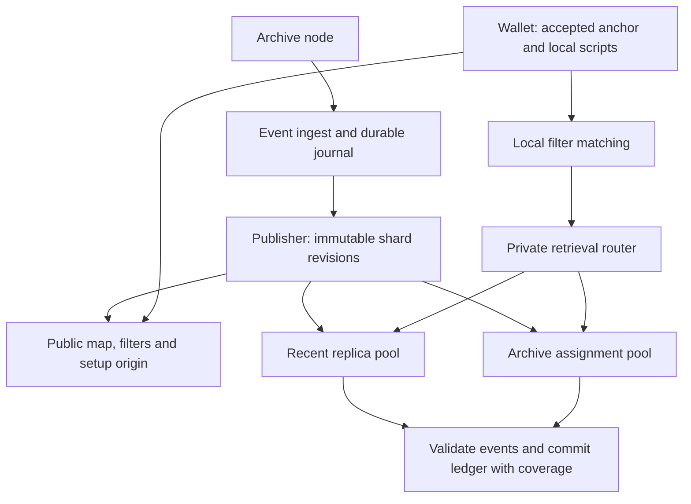

# Transparent PIR architecture

See [status](status.md) for source and live implementation evidence and [deployment](deployment.md) for target parameters.

## Data and recovery

The service indexes confirmed receive and spend events under exact raw locking scripts. Spend extraction resolves each consumed previous output to its script. The wallet reconstructs a ledger, applies its own confirmation and spendability policy, and accepts its chain anchor independently of shielded scanning. The [contract](contract.md) defines completeness and privacy assumptions.

A shard is a consecutive height range (called a generation in historical research). Each shard has a public activity filter, a private two-choice script directory and private packed event pages. Short histories may fit inline. A table can have multiple equal-geometry segments for an indivisible oversized block. Both directory candidate rows and every required page are retrieved privately across all table segments; routing must not expose the chosen row or segment.

A manifest may also publish a directory choice table: an xor-retrieval function recording which of each placed script's two candidate rows holds it. A wallet that reads it retrieves only that row, one directory query per matched script instead of two. The query count per matched script remains fixed for the shard, and absence is still decided by exact script comparison. The table is optional: directory rows are unchanged and a manifest without it serializes as before, so a set published without tables is served to every server and wallet. A manifest that carries one is not backward compatible: consumers built before the field recompute the manifest digest without it and refuse the shard. Every worker and wallet must be upgraded before any publication carries tables. The publisher and the server both verify that it routes every entry to its row before it is published or served, because a wrong bit would make a wallet read a present script as absent.

The wallet walks shards in order and commits each one atomically, but it need not wait for one shard's requests before sending the next shard's. The reference HTTP filter source fetches a walk's uncached filters concurrently. When the shard transport reports a concurrency above one and the sync has no work budget, the wallet matches every uncached shard of a pass locally first, then sends that pass's manifests and missing directory setups as one batch and, once the manifests verify, its directory queries as another. The walk consumes each outcome where it would have made that request, so the requests per shard and table, the byte charges, commits, refusal handling and retry budgets are those of the sequential walk; only their timing changes. Page setups and page queries stay sequential. Concurrency 1 is the sequential walk. Requests sent ahead for shards the walk does not reach, because it stopped or refreshed the map first, are sent but unused. Source: `transparent/crates/transparent-wallet/src/sync_ahead.rs`.

The router, assignment pools, external artifact origin and atomic fleet activation in this diagram are target components, not all implemented. The current service loads a whole published set.

## Component ownership

| Component | Source | Responsibility |
|---|---|---|
| Events | `transparent/crates/transparent-events` | Canonical chain event representation |
| Ingest, census, publish | `transparent/services/transparent-filter-server` | Resolve events, persist journal, seal and build shards, serve filters |
| Shard protocol | `transparent/crates/transparent-shard` | Geometry registry, deterministic packing, manifests and sealing |
| Retrieval service | `transparent/services/transparent-shard-server` | Verify publication, bound runtime cache, revision-addressed setup/query |
| Wallet | `transparent/crates/transparent-wallet` | Local matching, private retrieval, validation, ledger replay |
| Deployment | `ops/` and `.github/workflows/` | Build, distribute, preflight and activate artifacts |

## Identity and geometry

The source schema is `transparent-shard-v8`; the optional manifest field `directory_choice` does not change it. v8 widened directory and page rows from 3,584 to 4,096 bytes (16 directory slots, 41 events per page fragment) for the native PIR profile below. A shard declares a named geometry from the compiled registry. A manifest commits layout and table digests; the public map names manifest revisions. Sealed contents remain immutable and manifests chain through parent digests. A tier boundary must be a shard boundary. Profile names must never be reused with different row shapes.

Revision identity must be preserved through setup, query, response, runtime cache and wallet coverage. The server verifies manifests when opening a set. The wallet retrieves and verifies revision manifests, their map fields, parent digests and registry geometry before private requests. Hash consistency does not prove completeness or authenticate a malicious publisher's index merely because its terminal block hash is accepted.

The publisher supports recent/archive geometry and a forced `--recent-from` height. Census supports bounded inclusive ranges. A combined mixed-tier cost report must use the same boundaries and aggregate exact scripts across tiers; separate tier percentile summaries cannot be added.

## PIR scheme

Both tables use the native ReinspiRING two-mask m29 profile that Enhance and Status deploy: d = 2,048, q = 2^54, p = 2^16, a two-limb Gaussian `K_g` packing key with 19-bit limbs, and two public masks rounded to 29 bits. One 4,096-byte row is one 2,048-coefficient block. `transparent/crates/transparent-native` holds the shared helpers; it is adapted from `enhance_pir::native` rather than depending on it, because enabling the Enhance crates' `native-reinspiring` feature would switch the q48 Enhance binaries through Cargo feature unification.

Query masks and the packing setup are derived from 32-byte seeds per schema, geometry and table, so one query is answered by every segment of every shard of that geometry. `/v1/shards/init` publishes each table's `NativeScheme` identity (bit widths, parameter encoding, mask seed, setup id and sizes); the wallet re-derives it and refuses any difference. Each segment publishes its own 14,848 bytes of rounded masks. A query is an 8-byte revision binding, the 27,648-byte key and a 49-bit selection (`rows * 49 / 8` bytes): 77,832 bytes at 8,192 rows and 228,360 at 32,768. Each segment answers with the binding, an 8-byte mask epoch and a 5,632-byte body. The server parses a query once, scans each segment modulo 2^54 and packs against that segment's preprocessing.

Correctness certificates for this mode are snapshot-specific. The shard server's `native_certificate` example exports the `certify_native.py` report for a segment; see the [correctness screen](../evidence/native-certificate-2026-09-28/README.md) for the shape-level results and the 65,536-row limit.

## Serving and publication

The current cache retains prepared runtimes by byte reservation, builds on demand, and keeps active handles pinned. Plaintext sources are verified files rather than permanent copies in memory. Source defaults allow one construction, two evaluations and three superseded revisions per shard beyond the current one. An expired revision returns 409; cache pressure can return retryable 503. The wallet distinguishes these responses and bounds revision refreshes within one sync.

Cold builders hold their construction slot and queue fairly for shared scratch-memory admission. Each builder retains its turn while waiting for memory, so later work cannot repeatedly overtake it. Already-admitted queries wait at most 250 ms, bounded by their remaining deadline, for memory; restore reservations remain nonblocking; the shared memory ceiling and cancellation ownership rules apply to every path.

After cold construction drops its plaintext input and completed scratch buffers,
the worker shrinks the transient reservation to the retained runtime allowance
plus 2 MiB of serialization scratch and releases the construction slot. The
verified runtime becomes available immediately. A separate blocking snapshot writer
retains the reservation, runtime reference and cache pin through snapshot locking,
writing and durability, including after request cancellation. Snapshot failure
increments the cache error counter without invalidating the serving runtime.
`transparent_shard_disk_save_pending` tracks outstanding writers. Linux workers advise
the kernel that consumed source/cache files and synced snapshot files can leave
page cache; this is advisory and never deducted from measured admission usage.
Non-Linux workers omit the advice. A restored snapshot's two-mask preprocessing stays mapped from its immutable cache file rather than copied, so the advice cannot evict it.

Runtime construction encodes the segment, computes the public hint with exact lifted products against the table's query masks, and builds two-mask preprocessing per block. Database-dependent preprocessing is rebuilt for each changed table; client secrets and uploaded key bodies are never shared. The cache reserves the database, the published masks and the preprocessing at its eight-byte-word bound (64 MiB per block); built preprocessing has so far used four-byte words, so a runtime holds about 32 MiB less than it reserves. Runtime snapshots use format `transparent-runtime-v2/native-two-mask-m29/ipir-1f2aec6/reinspiring-0.1.2`: identity, checksum, column-major database, published masks, then `reinspiring::prepared_native` preprocessing, whose length is validated by range. A restore re-derives the masks from the preprocessing and refuses a snapshot whose stored masks differ. Writes keep the checksum, atomic rename and durability barriers.

The target recent pool fully replicates its assigned hot set so the newest shard can use every worker's bandwidth. Archive ownership is disjoint and balanced by prepared bytes. Public routing uses set identity, shard, revision and table; selected script, row and page locator never determine a plaintext route. Public immutable filters/setup belong on an artifact origin; map discovery has refreshable cache semantics.

Prepare and verify artifacts at owners before publishing routing/map state. `/v1/ready` reports assignment and revision identity and, in warm mode, requires every current assigned runtime to finish warming. The explicit loaded-only pilot mode has a weaker readiness condition. Completion of a prewarm task alone does not prove full warm readiness.

## Wallet state and aging

A returning wallet must retain old outputs while applying new spends. Moving the birthday forward is not ledger continuation. Every sync takes an explicit wallet-accepted height and hash, independently of the publication tip. A shard crossing that height is retrieved and validated in full; only its accepted prefix enters the ledger and discovery. Coverage retains both the full source revision endpoint and the accepted prefix endpoint. Ledger changes and coverage commit together; the completion anchor advances only after all required work succeeds. Replacing a provisional revision replaces its covered range; reorg recovery rolls back to the accepted ancestor.

Freeze the initial geometry cutoff. Aging may change worker ownership after verified copying, but it does not change shard geometry, ids or history. Re-cutting into wider archive geometry is a future epoch transition requiring explicit identity and coverage recovery; do not implement a rolling cutoff that silently rebuilds old shards.
