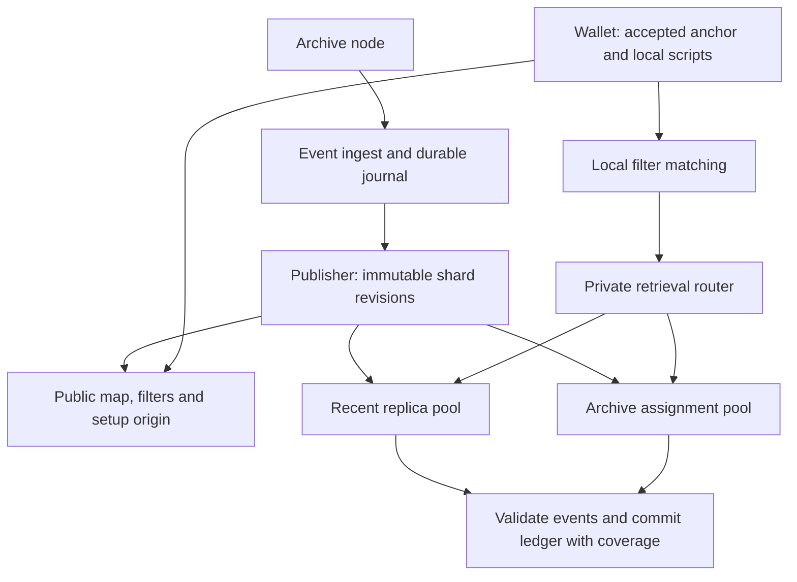

# Transparent PIR architecture

This describes the system as it exists in this repository's source. [Status](status.md)
records what is published and live, [deployment](deployment.md) owns the accepted
operating targets, and the [contract](contract.md) defines the completeness, privacy
and failure requirements all of it serves. Source establishes implementation and
never establishes a deployment. The compact schema v10 described below was deployed on 2026-09-28;
[the cutover evidence](../evidence/v10-cutover-2026-09-28/README.md) records its
actual source, publication, public checks and limits. The
[compact-layout evidence](../evidence/compact-layout-2026-09-28/README.md) owns the
storage analysis; [remaining work](remaining-work.md#schema-v10-qualification-and-republication)
tracks consumer and further performance qualification.

## Data and recovery

The service indexes confirmed receive and spend events under exact raw locking scripts.
Spend extraction resolves each consumed previous output to its script. The wallet
reconstructs a ledger, applies its own confirmation and spendability policy, and accepts
its chain anchor independently of shielded scanning.

A private table indexes scripts of at most 40 bytes, which covers the profile's supported
classes. The public filter still carries every element a block yields, so a longer script
can match a filter and be absent from the directory. Each manifest publishes both the
limit and the number of scripts it excluded, so a wallet holding one is told it is outside
coverage instead of reading a directory miss as absence.

A shard is a consecutive height range (called a generation in historical research). Each
shard has a public activity filter, a private two-choice script directory and private
packed event pages. Short histories may fit inline. A table can have multiple
equal-geometry segments for an indivisible oversized block. Both directory candidate rows
and every required page are retrieved privately across all table segments; routing must
not expose the chosen row or segment.

The assignment pools and the router are implemented: `shard-assign` plans a
`transparent-assignment-v1` from a roster, a worker loads either a whole published set or
only its assignment's shards, and the router's configuration is rendered from the
assignment alone and routes on the shard id in the path. The separate artifact origin is a
target; the publisher's own origins serve the public map, filters and setup today.

## Private transparent display capability

[Txid display](txid-display.md) answers one question privately: what a wallet
should show for one transparent transaction. Each transaction with a
transparent input or output has one fixed 113-byte entry (`transparent-txid-display-v2`):
- the fee, input and output counts, and a shielded-components bit;
- the first address-shaped source;
- outputs 0 and 1;
- flags naming what the entry leaves out (more source scripts, more outputs,
  shielded plus transparent funding).

Senders come from the spent outputs the extractor already resolves for fees.
This is separate from script history discovery.

The extractor writes the entries into block-hash-addressed sidecars under the
existing event checkpoint. The tiered `txid-display-controller` publishes them
as sealed archive shards and one per-block recent shard. Inside a shard, each
hash bucket is one table of 36-entry rows. A lookup is always two row queries,
so the server learns the range, tier, bucket and timing, but never the size of
the transaction.

`transparent-txid-server` serves the tables in archive-owner and
recent-replica roles. It shares the native runtime, cache and admission code
with history serving, but not `ShardSet`. History manifests and serving carry
no display tables.

A display failure cannot authorize a public lookup; a wallet asks publicly
only when the user explicitly requests it for one transaction. It is source
and local evidence only.

## Component ownership

| Component | Source | Responsibility |
|---|---|---|
| Events | `transparent/crates/transparent-events` | Canonical 87-byte chain event record |
| Filters | `transparent/crates/transparent-filter` | Range filter profiles, keying, encoding and validation |
| Shard protocol | `transparent/crates/transparent-shard` | Geometry registry, script tags, placement, deterministic packing, choice tables, manifests and sealing |
| Native PIR profile | `transparent/crates/transparent-native` over `shared/pir-native` | Transparent's seeds and scheme identity over the two-mask ReinspiRING helpers all three products share |
| Ingest, census, publish | `transparent/services/transparent-filter-server` | Resolve events, persist journal, seal and build shards, serve filters |
| Retrieval service | `transparent/services/transparent-shard-server` | Verify publication, bound runtime cache, revision-addressed setup/query |
| Wallet | `transparent/crates/transparent-wallet` | Local matching, private retrieval, validation, ledger replay |
| Wallet store | `transparent/crates/transparent-wallet-store` | Reference durable store on SQLite |
| Comparison baseline | `transparent/crates/transparent-blocks`, `transparent/services/transparent-block-server` | Pinned compact-block datasets for benchmark comparison; not a lightwalletd implementation |
| Deployment | `ops/` and `.github/workflows/` | Build, distribute, preflight and activate artifacts |

## Public membership filters

Each shard publishes one Golomb-coded set over the scripts active in its range, keyed by
profile name, genesis hash, shard id, height range and terminal block hash. Two range
profiles are compiled: `zcash-transparent-range-v1` at `P = 19, M = 784,931`, BIP 158's
basic parameters, and `zcash-transparent-range-v2` at `P = 10, M = 1,024`, about 45%
smaller and tuned for wallets testing up to roughly a hundred scripts. The publisher, the
shard builder and the wallet all take `P` and `M` from the published name and refuse a
name they do not know; read under another profile's parameters a filter neither fails
reliably nor matches correctly. Changing a set's profile is a new publication rather than
a continuation of one.

A false match costs one directory lookup, resolved by the tag comparison against the
retrieved row, and never creates a ledger event. Precision is therefore charged against
the number of scripts a wallet tests, not against block downloads as in BIP 158.

## Identity and geometry

The source schema is `transparent-shard-v10`. Both tables retain 4,096-byte rows,
which is one native PIR instance. Entries and events have variable widths within
those rows. Earlier shard bytes are refused, not reinterpreted. Schema v10 changes
neither the logical event model nor the version-2 journal's 87-byte record.

A shard declares a named geometry from the compiled registry: `recent-8k` (8,192 directory
and page rows), `recent-4k`, `recent-4k-8k`, `archive-32k` and `archive-wide` (32,768
directory rows against 65,536 page rows). The registry varies row counts only. Row width
and the inline allowance are compiled into the record codec, so moving either is a schema
bump and a republication rather than a new registry entry, and the build refuses to
publish a shape it can score but not encode.

A manifest commits layout and table digests; the public map names manifest revisions.
Sealed contents remain immutable and manifests chain through parent digests. A tier
boundary must be a shard boundary. Profile names must never be reused with different row
shapes.

Revision identity must be preserved through setup, query, response, runtime cache and
wallet coverage. The server verifies manifests when opening a set. The wallet retrieves and
verifies revision manifests, their map fields, parent digests and registry geometry before
private requests. Hash consistency does not prove completeness or authenticate a malicious
publisher's index merely because its terminal block hash is accepted.

The publisher supports recent/archive geometry and a forced `--recent-from` height. Census
supports bounded inclusive ranges. A combined mixed-tier cost report must use the same
boundaries and aggregate exact scripts across tiers; separate tier percentile summaries
cannot be added.

The event journal is version 2 and stores the 87-byte record. Opening a version-1 journal
returns an error and leaves the files in place; a version-2 journal is built only into a
new directory, either by re-ingest or by `journal-convert-v1`, which reads a committed
prefix of the source without taking a writer lock and renames the result into place only
once it is durable.

## Private record layout

Every PIR row is exactly 4,096 bytes. Entry offsets inside it depend on preceding
entry lengths, so decoding scans from the row header. Unknown flags, counts above
the row's decoder bounds, malformed references and nonzero trailing padding are
refused. Fixed response width remains unchanged; the number of page queries now
depends on event kinds and local receive/spend adjacency as well as history length.
That additional dependence was accepted for this layout.

A directory row starts with a 4-byte occupied-entry count, then packed entries.
Each entry contains a 14-byte script tag, a 4-byte first-page locator, a 1-byte
inline count and the newest one or two compact events. A paged entry must carry
two inline events. There is no stored total or fragment count. Entry sizes range
from 70 to 177 bytes; a linked receive/spend pair takes 113 bytes including its
header. At most 58 minimum-size entries fit a row. Unused inline slots and their
sentinel are gone; only the row's unused suffix is zero padding.

Compact events use these three canonical encodings, without alignment:

| Kind | Fields after flags | Bytes |
|---|---|---:|
| Receive | transaction index u16, height u32, value u64, txid 32, output index u32 | 51 |
| Spend | transaction index u16, height u32, spending txid 32, input index u32, spent txid 32, spent output index u32 | 79 |
| Local spend | transaction index u16, height u32, spending txid 32, input index u32 | 43 |

All integers are little endian. Flag bit 0 identifies a spend, bit 1 is coinbase
on receives only, and bit 2 marks a local spend. A local spend reconstructs its
outpoint from the immediately preceding receive in the same entry, and is
mandatory when that receive matches. References reset at every directory entry
and page fragment. An ordinary full outpoint in that situation is noncanonical.
The all-zero receive remains invalid. No form stores a script or block hash;
the wallet resolves height against its accepted chain.

The first-page locator is 1-based: `0` means inline-only, and `r >= 1` identifies
PIR row `r - 1` as the start of a contiguous run. Its first page reports fragment
count `K`. The wallet checks ordinals `0..K-1`, one shared `K`, canonical event
order, page-to-inline order, and greedy fragment boundaries. Before accepting
the next fragment, it verifies that its first event could not fit the preceding
fragment, including any local-reference saving that would have applied there.
The preceding event and encoded byte count are committed with pending work, so
this check also applies after restart. SQLite schema 3 adds that boundary state;
existing event and coverage rows survive the migration.

A page row starts with a 4-byte entry count. Each entry retains the 34-byte header:
script tag, fragment ordinal, fragment count, event count and two height bounds.
The event payload has a 4,058-byte budget. Greedy fragmentation takes the longest
prefix that fits it: up to 79 receives, 51 ordinary spends or 86 events arranged
as 43 local receive/spend pairs. The manifest's `events_per_page = 86` is a decoder
bound, not a fixed fragment length. At most 48 minimum-size page entries fit a row.

Long histories take contiguous runs in raw-script order. Their final rows offer
spare space to single-fragment histories. Short entries are ordered by decreasing
encoded byte length, then raw script, and placed in the tightest available row,
with row index breaking ties. An equal-byte-size grouping is also counted; the
builder uses it if it needs fewer rows and otherwise uses mixed packing. Neither
strategy claims optimal bin packing. The builder and sealer share the exact
byte-demand calculation, and publication verifies that the emitted row count
matches it. Sharing a row does not let a wallet skip another script's private
query.

### Sealing and capacity

The sealer projects each whole block against distinct scripts, actual directory
entry bytes and packed page rows. Directory bytes have a capacity of
`directory_rows * 4092` and a target reserving one seventh, independently of the
absolute script-count bound. The page target reserves one thirty-second. The
byte reserve helps placement but does not prove that every shard fits one
segment. An indivisible oversized block still receives extra segments.

Compact storage changes shard boundaries and public filters, so adoption requires
a separate publication and corresponding clients. Per-row native PIR geometry
is unchanged, but denser bytes can change native noise bounds and table workloads.
Capacity measurements do not establish throughput, latency or native correctness
for a new served snapshot; those require qualification on its actual tables.

### Script tags

A record identifies its script by a 14-byte tag rather than the raw bytes: the first 14
bytes of a domain-separated SHA-256 over the complete script under a per-revision salt. The
salt is itself a domain-separated SHA-256 of the shard id, the revision's terminal block
hash in internal byte order and a `tag_salt_counter` field the manifest carries. The wallet
recomputes the salt from those three verified inputs and never accepts one supplied
separately, so a publisher cannot choose a predictable salt, and every transaction in a
revision is mined at or before its terminal block, so no indexed script can have been
selected against a known salt.

The counter starts at 0 and increases only when the builder finds two indexed scripts whose
tags collide, at which point it recomputes every tag and checks again, up to eight times. It
never drops a script and never publishes duplicate tags. Placement and the choice table stay
keyed on the raw script, so moving the counter changes tags alone.

This replaces byte-for-byte script equality with attribution under a 112-bit tag. The wallet
compares tags only within the candidate rows it retrieved and reaches a page only through a
directory match, so the exposure is a wrong event attributed to a wallet whose script
collides with an indexed one, not a privacy leak, and rows carry no integrity authentication
in any case: a server that lies can return wrong events at any tag length. Duplicate tags in
a decoded row, a tag that disagrees between directory and page, and any count, order or
padding failure stop recovery for the shard. None of them may fall back to prefix matching
or to public address retrieval.

## Directory placement and the choice table

Each script has two candidate directory rows, hashed under independently domain-separated
per-shard salts, so a row learned in one shard says nothing about the same script's row in
another. Placement processes decreasing entry sizes, then raw script, choosing
the less occupied candidate by bytes. If neither fits, a bounded deterministic
relocation search tries moving residents to their alternate candidates. Its
512-node limit and single-resident moves can miss a feasible packing; failure
adds a directory segment and retries. A failure never triggers public lookup.

Without a choice table the wallet retrieves both candidates, because querying one and
stopping on a hit would make the query count a function of where the script landed. A
manifest may instead publish a choice table: an xor-retrieval function over three equal bit
segments, three positions per key whose xor is that key's bit, at about 1.23 bits per placed
script. It stores no key, fingerprint or row, and it is not a membership test — a script
that was never placed evaluates to an arbitrary bit, and the tag comparison against the
returned row is what settles absence, exactly as it does for the two-query lookup.
Construction is deterministic in the shard id and the placed pairs, retrying seeds until one
peels.

The table is optional: a manifest without it serializes without the field and keeps its
bytes and digest. A manifest that carries one is not backward compatible, because consumers
built before the field drop it, recompute a different manifest digest and refuse the shard.
The publisher adds tables only to revisions it builds anew (`--directory-choice
off|sealed|all`, default `off`) and verifies that the table routes every script to its row
while it still has the scripts. A private row stores a tag rather than the raw script, so the
route cannot be recomputed at load; the server decodes every directory row and checks that
the table's key count equals the entry count.

## PIR scheme

Both tables use the native ReinspiRING two-mask m29 profile that Enhance and Status deploy:
d = 2,048, q = 2^54, p = 2^16, a two-limb Gaussian `K_g` packing key with 19-bit limbs, and
two public masks rounded to 29 bits. One 4,096-byte row is one 2,048-coefficient block.
The helpers are the root `shared/pir-native` crate, which Enhance and Status use too; its
golden test pins their bytes. It has no Cargo features, so depending on it cannot switch the
q48 Enhance binaries, which only `enhance-pir/native-reinspiring` does.
`transparent/crates/transparent-native` re-exports it and adds Transparent's per-geometry
seeds, `NativeScheme` and `TableProfile`.

Query masks and the packing setup are derived from 32-byte seeds per schema, geometry and
table, so one query is answered by every segment of every shard of that geometry.
`/v1/shards/init` publishes each table's `NativeScheme` identity (bit widths, parameter
encoding, mask seed, setup id and sizes); the wallet re-derives it and refuses any
difference. Each segment publishes its own 14,848 bytes of rounded masks. A query is an
8-byte revision binding, the 27,648-byte key and a 49-bit selection (`rows * 49 / 8` bytes):
77,832 bytes at 8,192 rows and 228,360 at 32,768. Each segment answers with the binding, an
8-byte mask epoch and a 5,632-byte body. The server parses a query once, scans each segment
modulo 2^54 and packs against that segment's preprocessing.

Correctness certificates for this mode are snapshot-specific. The shard server's
`native_certificate` example exports the `certify_native.py` report for a segment; see the
[correctness screen](../evidence/native-certificate-2026-09-28/README.md) for the
shape-level results and the 65,536-row limit.

## The wallet's walk

The wallet walks shards in order and commits each one atomically, but it need not wait for
one shard's requests before sending the next shard's. The reference HTTP filter source
fetches a walk's uncached filters concurrently. When the shard transport reports a
concurrency above one and the sync has no work budget, the wallet matches every uncached
shard of a pass locally first, then sends that pass's manifests and missing directory setups
as one batch and, once the manifests verify, its directory queries as another. The walk
consumes each outcome where it would have made that request, so the requests per shard and
table, the byte charges, commits, refusal handling and retry budgets are those of the
sequential walk; only their timing changes. Page setups and page queries stay sequential,
because which pages a script needs is known only after its directory entry decodes.
Concurrency 1 is the sequential walk. Requests sent ahead for shards the walk does not
reach, because it stopped or refreshed the map first, are sent but unused. No query is
skipped because an unrelated response happened to mention a watched script. Source:
`transparent/crates/transparent-wallet/src/sync_ahead.rs`.

## Serving and publication

The current cache retains prepared runtimes by byte reservation, builds on demand, and keeps
active handles pinned. Plaintext sources are verified files rather than permanent copies in
memory. Source defaults allow one construction, two evaluations and three superseded
revisions per shard beyond the current one. An expired revision returns 409; cache pressure
can return retryable 503. The wallet distinguishes these responses and bounds revision
refreshes within one sync.

Cold builders hold their construction slot and queue fairly for shared scratch-memory
admission. Each builder retains its turn while waiting for memory, so later work cannot
repeatedly overtake it. Already-admitted queries wait at most 250 ms, bounded by their
remaining deadline, for memory; restore reservations remain nonblocking; the shared memory
ceiling and cancellation ownership rules apply to every path.

After cold construction drops its plaintext input and completed scratch buffers, the worker
shrinks the transient reservation to the retained runtime allowance plus 2 MiB of
serialization scratch and releases the construction slot. The verified runtime becomes
available immediately. A separate blocking snapshot writer retains the reservation, runtime
reference and cache pin through snapshot locking, writing and durability, including after
request cancellation. Snapshot failure increments the cache error counter without
invalidating the serving runtime. `transparent_shard_disk_save_pending` tracks outstanding
writers. Linux workers advise the kernel that consumed source/cache files and synced
snapshot files can leave page cache. The advice lowers the cgroup's charge; admission does
not depend on it. Admission measures the cgroup's memory in use: `memory.current` less the
clean file pages no process maps, which the kernel drops before an OOM kill. Mapped,
dirty and writeback file pages stay counted. Non-Linux workers omit the advice and the
cgroup check. A restored snapshot's two-mask preprocessing stays mapped from its immutable
cache file rather than copied, so the advice cannot evict it and admission counts it.

Runtime construction encodes the segment, computes the public hint with exact lifted
products against the table's query masks, and builds two-mask preprocessing per block.
For the recent geometries only, trailing all-zero row blocks are left out of the product
and the hint (`transparent_native::batched_hint`) transforms 32 columns at a time under
three 30-bit primes and reduces the CRT-reconstructed integer sum modulo `q`. It equals the
shared `pir_native::hint` exactly, and masks beyond its checked capacity are handed to that
reference. Archive geometries, and any geometry not listed, use `pir_native::hint` over
every block.
Database-dependent preprocessing is rebuilt for each changed table; client secrets and
uploaded key bodies are never shared. The cache admits a new runtime against the database,
the published masks and the preprocessing at its eight-byte-word bound (64 MiB per block),
and charges it that bound until the build or restore has produced it. It then charges what
the runtime holds (`TableRuntime::held_bytes`): the same terms with the compiled matrix at
its real width, four-byte words so far, or 27/28-bit packed on CPUs with AVX-512 VBMI. The
charge only falls, the release happens before any waiter receives the runtime, and eviction
returns exactly the lowered charge, so builds in flight together cannot be admitted past
the budget on sizes they have not reached. `txid-2k` reserves 72.05 MiB and is charged
40.05 MiB built; `txid-4k` 80.05 and 48.05 MiB; `shard-residency` measured 40.3–41.3 and
48.2–48.3 MiB. Warm-mode fit checks (history and display) plan with the four-byte size plus
one bound's excess per runtime the prewarm can have in flight, which never exceeds the sum
of bounds they used to demand. The disk cache works the same way: a write reserves the
largest valid entry under its directory lock, a written entry counts at its file length,
and the preflight charges missing entries at their four-byte length plus one bound's excess.
A runtime whose matrix needs eight-byte words keeps its full charge, so a plan made at the
four-byte size comes up short through overloads, never through memory. The assignment
planner (`router::plan`) still balances and checks owners at the bound.
Runtime snapshots use format
`transparent-runtime-v2/native-two-mask-m29/ipir-1f2aec6/reinspiring-0.1.2`: identity,
checksum, column-major database, published masks, then `reinspiring::prepared_native`
preprocessing, whose length is validated by range. A restore re-derives the masks from the
preprocessing and refuses a snapshot whose stored masks differ. Writes keep the checksum,
atomic rename and durability barriers.

The target recent pool fully replicates its assigned hot set so the newest shard can use
every worker's bandwidth. Archive ownership is disjoint and balanced by prepared bytes.
Public routing uses set identity, shard, revision and table; selected script, row and page
locator never determine a plaintext route. Public immutable filters/setup belong on an
artifact origin; map discovery has refreshable cache semantics.

Prepare and verify artifacts at owners before publishing routing/map state. `/v1/ready`
reports assignment and revision identity and, in warm mode, requires every current assigned
runtime to finish warming. The explicit loaded-only pilot mode has a weaker readiness
condition. Completion of a prewarm task alone does not prove full warm readiness.

## Wallet state and aging

A returning wallet must retain old outputs while applying new spends. Moving the birthday
forward is not ledger continuation. Every sync takes an explicit wallet-accepted height and
hash, independently of the publication tip. A shard crossing that height is retrieved and
validated in full; only its accepted prefix enters the ledger and discovery. Coverage
retains both the full source revision endpoint and the accepted prefix endpoint. Ledger
changes and coverage commit together; the completion anchor advances only after all required
work succeeds. Replacing a provisional revision replaces its covered range; reorg recovery
rolls back to the accepted ancestor.

Freeze the initial geometry cutoff. Aging may change worker ownership after verified
copying, but it does not change shard geometry, ids or history. Rebuilding sealed shards
under other boundaries, such as merging sealed recent shards into wider archive shards, is
allowed only as a declared re-cut; do not implement a rolling cutoff that silently rebuilds
old shards.

### Declared re-cuts

A re-cut rebuilds sealed history from some height up under other boundaries. That changes
the ids and digests of every shard from there up, the tail included, but not the chain, so a
wallet that already covers those heights needs nothing new. The map says so in `recuts`
(`transparent-filter` `wire.rs`): for each re-cut an epoch, the first changed height, and
every entry the previous map published at or above it, exactly as published (id, geometry,
range, terminal block, digest, revision, sealed), the old tail included. A map never re-cut
omits the field and keeps its bytes and digest. `ShardMap::check_shape` refuses a
declaration whose epochs do not rise, whose entries do not follow one another from the first
changed height, that marks any entry but the last unsealed, names a digest the map still
publishes or one declared twice, or names a geometry without seal parameters, and a map whose
entry at a declared entry's geometry and start height does not carry a higher revision. The
newest re-cut's first height must be a shard boundary of the map. Every declared digest and
terminal block hash must be 64 lowercase hex digits, every declared height must fit in 32
bits, and a map may declare at most 65,536 superseded entries across all its re-cuts
(`MAX_SUPERSEDED`), far above any real publication, so a hostile map cannot make wallets
store or scan an unbounded list. The checks themselves cannot overflow on hostile values.

A wallet (`transparent-wallet` `sync.rs`) keeps its history across a declared re-cut:

- Stored sealed coverage is looked up by the height it starts at, not by shard id. It stays
  good while the map publishes that revision there, or declares exactly that revision
  superseded: same digest, shard id and start height, sealed, ending on the same block. The
  block a range ends on is its source anchor, which every store since SQLite schema 2 keeps;
  a range without one (an older custom store) matches a declaration only if its covered end
  height and block are the declared ones. Nothing under a matched range is read again.
- A sealed range the map neither still publishes nor declares superseded is judged by the
  block it rests on. If the wallet's chain rejects that block, it is a reorg and is rolled
  back like any other. If the chain still accepts it, the chain did not change and the map
  did: the sync ends with `SyncError::SealedRewrite { start_height, revision_digest }`
  before anything is rolled back or read, whichever range the store holds newest. If the
  chain cannot place the block, the sync stops as for any unknown block
  (`chain-unknown`). A range cut short of its shard's end by a target or a rollback is left
  to the ordinary chain checks, because a reorg above the cut changes the shard's digest
  without touching what the range covers.
- Unfinished page work under a revision the map no longer publishes is dropped and done
  again under the shard now covering its heights. What that revision already saved stays
  only when the map declares it sealed (under the same shard id) and the wallet's chain
  still accepts the target block that item was read for, which the store keeps with it and
  which every event it saved lies at or below. The declaration's own heights and blocks are
  not relied on. Otherwise the store rolls back from the lowest height the revision saved an
  event at, or from its declared start if that is lower, moved down to the start of the
  shard now covering that height; a revision that saved nothing leaves nothing to roll
  back. Events are kept once per outpoint, so reading a height again never counts one
  twice. Kept events sit without coverage until the gap is read, so a sync stopped first
  reports the range uncovered.
- Provisional coverage from a tail the map no longer publishes is rolled back from its start
  and read again from the new tail, as for any replaced tail.
- A new coverage range replaces every range of the script it contains, whatever shard it
  came from, so a wider shard starting at a covered height does not clash with the narrower
  ones. A range strictly inside the one the script holds starting nearest at or below it
  changes nothing. Both reference stores follow these rules, and the SQLite schema is
  unchanged (version 4).
- A map refreshed during a sync whose re-cut epoch differs from the one the sync started
  from ends that sync with `MapDiverged`; so does one that moves the shard id the walk
  resumes at to another start height. The next sync starts from the re-cut map.
- Filters fetched ahead of a walk are dropped at the next prefetch or map fetch, since a
  re-cut gives their shard ids to other ranges.

What a re-cutting publisher must guarantee, and wallets rely on:

- Entries below the first changed height are byte-identical. That height and the end of the
  re-cut span are sealed boundaries of the previous map with unchanged terminal blocks, and
  the new entries cover exactly the heights the replaced ones did.
- Revisions are numbered per geometry and start height, not per shard id. A new entry at the
  geometry and start height of any earlier entry, the tail included, takes a higher revision.
  The tail keeps its start height and geometry.
- Every changed entry is declared exactly as it was published. Declarations are kept
  forever, in strictly increasing epochs, so a wallet offline across several re-cuts still
  recognizes what it holds; a superseded digest is never published again; seal parameters
  stay published for every geometry any declaration names.
- Production is not re-cut until every client in use reads declarations. An older client
  ignores the field and stalls or refuses on the re-cut map.

No publisher builds re-cut maps yet; the continuous publisher writes an empty `recuts` and
would have to carry every earlier declaration forward. See
[remaining work](remaining-work.md).
