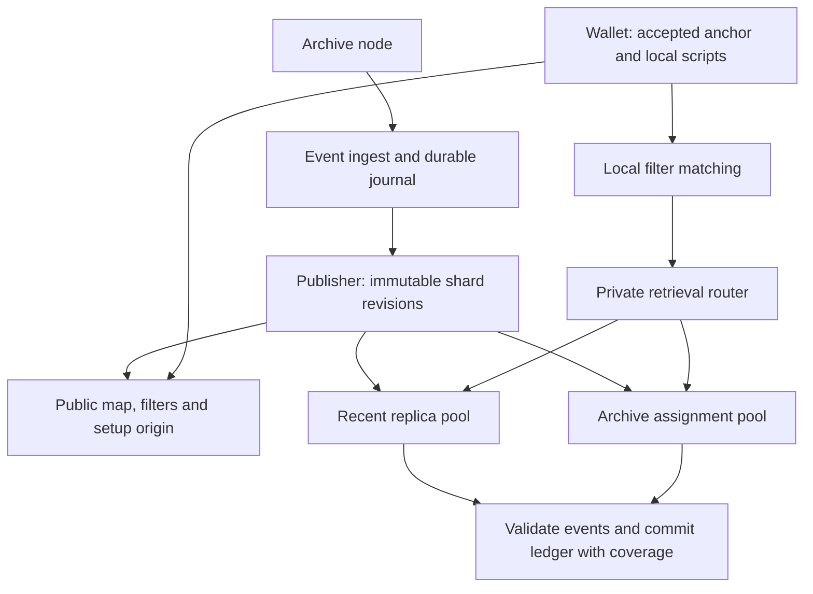

# Transparent PIR architecture

This describes the system as it exists in this repository's source. [Status](status.md)
records what is published and live, [deployment](deployment.md) owns the accepted
operating targets, and the [contract](contract.md) defines the completeness, privacy
and failure requirements all of it serves. Source establishes implementation and
never establishes a deployment: schema v9, the v2 filter profile and the
`recent-4k-8k` geometry are implemented and unpublished.

## Data and recovery

The service indexes confirmed receive and spend events under exact raw locking scripts.
Spend extraction resolves each consumed previous output to its script. The wallet
reconstructs a ledger, applies its own confirmation and spendability policy, and accepts
its chain anchor independently of shielded scanning.

A private table indexes scripts of at most 40 bytes, which covers the profile's supported
classes. The public filter still carries every element a block yields, so a longer script
can match a filter and be absent from the directory. Each manifest publishes both the
limit and the number of scripts it excluded, so a wallet holding one is told it is outside
coverage instead of reading a directory miss as absence.

A shard is a consecutive height range (called a generation in historical research). Each
shard has a public activity filter, a private two-choice script directory and private
packed event pages. Short histories may fit inline. A table can have multiple
equal-geometry segments for an indivisible oversized block. Both directory candidate rows
and every required page are retrieved privately across all table segments; routing must
not expose the chosen row or segment.

The assignment pools and the router are implemented: `shard-assign` plans a
`transparent-assignment-v1` from a roster, a worker loads either a whole published set or
only its assignment's shards, and the router's configuration is rendered from the
assignment alone and routes on the shard id in the path. The separate artifact origin is a
target; the publisher's own origins serve the public map, filters and setup today.

## Component ownership

| Component | Source | Responsibility |
|---|---|---|
| Events | `transparent/crates/transparent-events` | Canonical 87-byte chain event record |
| Filters | `transparent/crates/transparent-filter` | Range filter profiles, keying, encoding and validation |
| Shard protocol | `transparent/crates/transparent-shard` | Geometry registry, script tags, placement, deterministic packing, choice tables, manifests and sealing |
| Native PIR profile | `transparent/crates/transparent-native` | The two-mask ReinspiRING helpers the server and wallet share |
| Ingest, census, publish | `transparent/services/transparent-filter-server` | Resolve events, persist journal, seal and build shards, serve filters |
| Retrieval service | `transparent/services/transparent-shard-server` | Verify publication, bound runtime cache, revision-addressed setup/query |
| Wallet | `transparent/crates/transparent-wallet` | Local matching, private retrieval, validation, ledger replay |
| Wallet store | `transparent/crates/transparent-wallet-store` | Reference durable store on SQLite |
| Comparison baseline | `transparent/crates/transparent-blocks`, `transparent/services/transparent-block-server` | Pinned compact-block datasets for benchmark comparison; not a lightwalletd implementation |
| Deployment | `ops/` and `.github/workflows/` | Build, distribute, preflight and activate artifacts |

## Public membership filters

Each shard publishes one Golomb-coded set over the scripts active in its range, keyed by
profile name, genesis hash, shard id, height range and terminal block hash. Two range
profiles are compiled: `zcash-transparent-range-v1` at `P = 19, M = 784,931`, BIP 158's
basic parameters, and `zcash-transparent-range-v2` at `P = 10, M = 1,024`, about 45%
smaller and tuned for wallets testing up to roughly a hundred scripts. The publisher, the
shard builder and the wallet all take `P` and `M` from the published name and refuse a
name they do not know; read under another profile's parameters a filter neither fails
reliably nor matches correctly. Changing a set's profile is a new publication rather than
a continuation of one.

A false match costs one directory lookup, resolved by the tag comparison against the
retrieved row, and never creates a ledger event. Precision is therefore charged against
the number of scripts a wallet tests, not against block downloads as in BIP 158.

## Identity and geometry

The source schema is `transparent-shard-v9`. Both tables use 4,096-byte rows, which is one
native PIR instance. A directory entry is 192 bytes and a row holds 21 of them; a page
fragment holds 46 events. v8 and v7 bytes are not reinterpreted.

A shard declares a named geometry from the compiled registry: `recent-8k` (8,192 directory
and page rows), `recent-4k`, `recent-4k-8k`, `archive-32k` and `archive-wide` (32,768
directory rows against 65,536 page rows). The registry varies row counts only. Row width
and the inline allowance are compiled into the record codec, so moving either is a schema
bump and a republication rather than a new registry entry, and the build refuses to
publish a shape it can score but not encode.

A manifest commits layout and table digests; the public map names manifest revisions.
Sealed contents remain immutable and manifests chain through parent digests. A tier
boundary must be a shard boundary. Profile names must never be reused with different row
shapes.

Revision identity must be preserved through setup, query, response, runtime cache and
wallet coverage. The server verifies manifests when opening a set. The wallet retrieves and
verifies revision manifests, their map fields, parent digests and registry geometry before
private requests. Hash consistency does not prove completeness or authenticate a malicious
publisher's index merely because its terminal block hash is accepted.

The publisher supports recent/archive geometry and a forced `--recent-from` height. Census
supports bounded inclusive ranges. A combined mixed-tier cost report must use the same
boundaries and aggregate exact scripts across tiers; separate tier percentile summaries
cannot be added.

The event journal is version 2 and stores the 87-byte record. Opening a version-1 journal
returns an error and leaves the files in place; a version-2 journal is built only into a
new directory, either by re-ingest or by `journal-convert-v1`, which reads a committed
prefix of the source without taking a writer lock and renames the result into place only
once it is durable.

## Private record layout

Every row is fixed width and every field sits at a fixed offset. A PIR response has fixed
geometry, so a row whose size depended on what it held would leak that through the
response; padding is the mechanism rather than waste. Unused slots, reserved bits and
trailing row bytes must all be zero, and a decoder rejects a claimed count above what a row
can hold before computing any offset from it.

A directory row is a 4-byte occupied-entry count and 21 entries, leaving 60 bytes no slot
can reach. An entry is a 14-byte script tag, a 4-byte first-page locator and two 87-byte
inline event slots. There is no stored total, inline count or fragment count.

An event record carries a flags byte (bit 0 kind, bit 1 coinbase, valid only on a receive),
transaction index, height, value, txid, output or input index, and the spent outpoint,
packed without alignment. Unknown flag bits are refused. An all-zero record is not a valid
event, which is what lets it serve as the empty inline-slot sentinel: occupied slots are the
zero-free prefix of the two. A record holds no script and no block hash. The script is the
key its container carries, and the wallet resolves height to hash against its own accepted
chain rather than taking a branch from the server.

The first-page locator is 1-based, so absence does not collide with row 0: `0` means the
history is exactly the occupied inline slots, and `r >= 1` names PIR row `r - 1` as the
start of a contiguous run. The wallet fetches that row, reads the fragment count `K` from
the entry it matches, then fetches the rest of the run. Completeness is structural —
ordinals `0..K-1` exactly, one shared `K`, non-final fragments full, canonical order — so a
paged script's remaining query budget is known after its first page response rather than
from the directory.

A page row is a 4-byte entry count and one or more entries under a 34-byte header: the tag,
fragment ordinal, fragment count, event count and the two height bounds. A fragment holds
at most 46 events and a full one uses 4,040 bytes of the row. Short histories of equal paged
length share a row — 33 entries at one paged event, 19 at two, 13 at three, and one from 24
upward, where an entry exceeds half a row. A long history takes a contiguous run of rows and
shares its last with nothing. The page tag must equal the tag the wallet derived and the
directory entry matched.

### Script tags

A record identifies its script by a 14-byte tag rather than the raw bytes: the first 14
bytes of a domain-separated SHA-256 over the complete script under a per-revision salt. The
salt is itself a domain-separated SHA-256 of the shard id, the revision's terminal block
hash in internal byte order and a `tag_salt_counter` field the manifest carries. The wallet
recomputes the salt from those three verified inputs and never accepts one supplied
separately, so a publisher cannot choose a predictable salt, and every transaction in a
revision is mined at or before its terminal block, so no indexed script can have been
selected against a known salt.

The counter starts at 0 and increases only when the builder finds two indexed scripts whose
tags collide, at which point it recomputes every tag and checks again, up to eight times. It
never drops a script and never publishes duplicate tags. Placement and the choice table stay
keyed on the raw script, so moving the counter changes tags alone.

This replaces byte-for-byte script equality with attribution under a 112-bit tag. The wallet
compares tags only within the candidate rows it retrieved and reaches a page only through a
directory match, so the exposure is a wrong event attributed to a wallet whose script
collides with an indexed one, not a privacy leak, and rows carry no integrity authentication
in any case: a server that lies can return wrong events at any tag length. Duplicate tags in
a decoded row, a tag that disagrees between directory and page, and any count, order or
padding failure stop recovery for the shard. None of them may fall back to prefix matching
or to public address retrieval.

## Directory placement and the choice table

Each script has two candidate directory rows, hashed under independently domain-separated
per-shard salts, so a row learned in one shard says nothing about the same script's row in
another. Two choices pack far better than one for one extra query, where four cost two extra
queries for less improvement. A script that fits in neither candidate is not resolved by a
public lookup, which would reveal the script; the shard is given another directory segment
and placement runs again.

Without a choice table the wallet retrieves both candidates, because querying one and
stopping on a hit would make the query count a function of where the script landed. A
manifest may instead publish a choice table: an xor-retrieval function over three equal bit
segments, three positions per key whose xor is that key's bit, at about 1.23 bits per placed
script. It stores no key, fingerprint or row, and it is not a membership test — a script
that was never placed evaluates to an arbitrary bit, and the tag comparison against the
returned row is what settles absence, exactly as it does for the two-query lookup.
Construction is deterministic in the shard id and the placed pairs, retrying seeds until one
peels.

The table is optional: a manifest without it serializes without the field and keeps its
bytes and digest. A manifest that carries one is not backward compatible, because consumers
built before the field drop it, recompute a different manifest digest and refuse the shard.
The publisher adds tables only to revisions it builds anew (`--directory-choice
off|sealed|all`, default `off`) and verifies that the table routes every script to its row
while it still has the scripts. A v9 row stores a tag rather than the raw script, so the
route cannot be recomputed at load; the server decodes every directory row and checks that
the table's key count equals the entry count.

## PIR scheme

Both tables use the native ReinspiRING two-mask m29 profile that Enhance and Status deploy:
d = 2,048, q = 2^54, p = 2^16, a two-limb Gaussian `K_g` packing key with 19-bit limbs, and
two public masks rounded to 29 bits. One 4,096-byte row is one 2,048-coefficient block.
`transparent/crates/transparent-native` holds the shared helpers; it is adapted from
`enhance_pir::native` rather than depending on it, because enabling the Enhance crates'
`native-reinspiring` feature would switch the q48 Enhance binaries through Cargo feature
unification.

Query masks and the packing setup are derived from 32-byte seeds per schema, geometry and
table, so one query is answered by every segment of every shard of that geometry.
`/v1/shards/init` publishes each table's `NativeScheme` identity (bit widths, parameter
encoding, mask seed, setup id and sizes); the wallet re-derives it and refuses any
difference. Each segment publishes its own 14,848 bytes of rounded masks. A query is an
8-byte revision binding, the 27,648-byte key and a 49-bit selection (`rows * 49 / 8` bytes):
77,832 bytes at 8,192 rows and 228,360 at 32,768. Each segment answers with the binding, an
8-byte mask epoch and a 5,632-byte body. The server parses a query once, scans each segment
modulo 2^54 and packs against that segment's preprocessing.

Correctness certificates for this mode are snapshot-specific. The shard server's
`native_certificate` example exports the `certify_native.py` report for a segment; see the
[correctness screen](../evidence/native-certificate-2026-09-28/README.md) for the
shape-level results and the 65,536-row limit.

## The wallet's walk

The wallet walks shards in order and commits each one atomically, but it need not wait for
one shard's requests before sending the next shard's. The reference HTTP filter source
fetches a walk's uncached filters concurrently. When the shard transport reports a
concurrency above one and the sync has no work budget, the wallet matches every uncached
shard of a pass locally first, then sends that pass's manifests and missing directory setups
as one batch and, once the manifests verify, its directory queries as another. The walk
consumes each outcome where it would have made that request, so the requests per shard and
table, the byte charges, commits, refusal handling and retry budgets are those of the
sequential walk; only their timing changes. Page setups and page queries stay sequential,
because which pages a script needs is known only after its directory entry decodes.
Concurrency 1 is the sequential walk. Requests sent ahead for shards the walk does not
reach, because it stopped or refreshed the map first, are sent but unused. No query is
skipped because an unrelated response happened to mention a watched script. Source:
`transparent/crates/transparent-wallet/src/sync_ahead.rs`.

## Serving and publication

The current cache retains prepared runtimes by byte reservation, builds on demand, and keeps
active handles pinned. Plaintext sources are verified files rather than permanent copies in
memory. Source defaults allow one construction, two evaluations and three superseded
revisions per shard beyond the current one. An expired revision returns 409; cache pressure
can return retryable 503. The wallet distinguishes these responses and bounds revision
refreshes within one sync.

Cold builders hold their construction slot and queue fairly for shared scratch-memory
admission. Each builder retains its turn while waiting for memory, so later work cannot
repeatedly overtake it. Already-admitted queries wait at most 250 ms, bounded by their
remaining deadline, for memory; restore reservations remain nonblocking; the shared memory
ceiling and cancellation ownership rules apply to every path.

After cold construction drops its plaintext input and completed scratch buffers, the worker
shrinks the transient reservation to the retained runtime allowance plus 2 MiB of
serialization scratch and releases the construction slot. The verified runtime becomes
available immediately. A separate blocking snapshot writer retains the reservation, runtime
reference and cache pin through snapshot locking, writing and durability, including after
request cancellation. Snapshot failure increments the cache error counter without
invalidating the serving runtime. `transparent_shard_disk_save_pending` tracks outstanding
writers. Linux workers advise the kernel that consumed source/cache files and synced
snapshot files can leave page cache; this is advisory and never deducted from measured
admission usage. Non-Linux workers omit the advice. A restored snapshot's two-mask
preprocessing stays mapped from its immutable cache file rather than copied, so the advice
cannot evict it.

Runtime construction encodes the segment, computes the public hint with exact lifted
products against the table's query masks, and builds two-mask preprocessing per block.
Database-dependent preprocessing is rebuilt for each changed table; client secrets and
uploaded key bodies are never shared. The cache reserves the database, the published masks
and the preprocessing at its eight-byte-word bound (64 MiB per block); built preprocessing
has so far used four-byte words, so a runtime holds about 32 MiB less than it reserves.
Runtime snapshots use format
`transparent-runtime-v2/native-two-mask-m29/ipir-1f2aec6/reinspiring-0.1.2`: identity,
checksum, column-major database, published masks, then `reinspiring::prepared_native`
preprocessing, whose length is validated by range. A restore re-derives the masks from the
preprocessing and refuses a snapshot whose stored masks differ. Writes keep the checksum,
atomic rename and durability barriers.

The target recent pool fully replicates its assigned hot set so the newest shard can use
every worker's bandwidth. Archive ownership is disjoint and balanced by prepared bytes.
Public routing uses set identity, shard, revision and table; selected script, row and page
locator never determine a plaintext route. Public immutable filters/setup belong on an
artifact origin; map discovery has refreshable cache semantics.

Prepare and verify artifacts at owners before publishing routing/map state. `/v1/ready`
reports assignment and revision identity and, in warm mode, requires every current assigned
runtime to finish warming. The explicit loaded-only pilot mode has a weaker readiness
condition. Completion of a prewarm task alone does not prove full warm readiness.

## Wallet state and aging

A returning wallet must retain old outputs while applying new spends. Moving the birthday
forward is not ledger continuation. Every sync takes an explicit wallet-accepted height and
hash, independently of the publication tip. A shard crossing that height is retrieved and
validated in full; only its accepted prefix enters the ledger and discovery. Coverage
retains both the full source revision endpoint and the accepted prefix endpoint. Ledger
changes and coverage commit together; the completion anchor advances only after all required
work succeeds. Replacing a provisional revision replaces its covered range; reorg recovery
rolls back to the accepted ancestor.

Freeze the initial geometry cutoff. Aging may change worker ownership after verified
copying, but it does not change shard geometry, ids or history. Re-cutting into wider archive
geometry is a future epoch transition requiring explicit identity and coverage recovery; do
not implement a rolling cutoff that silently rebuilds old shards.
